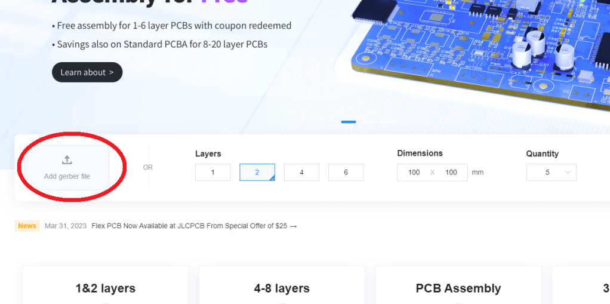
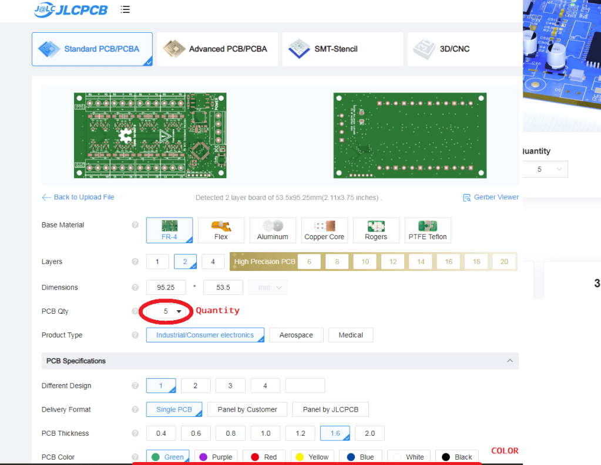
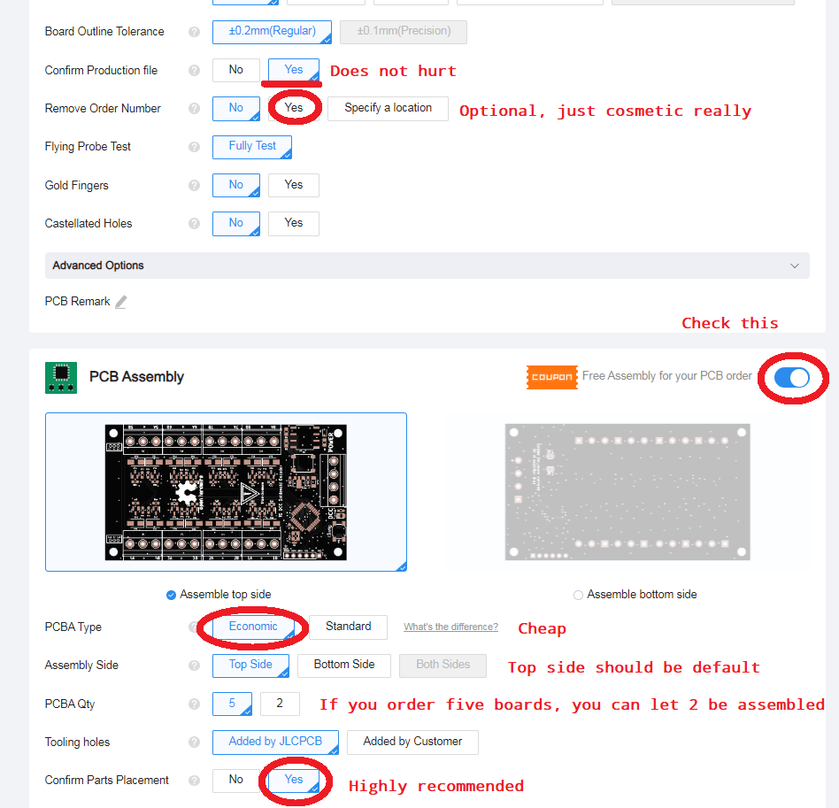
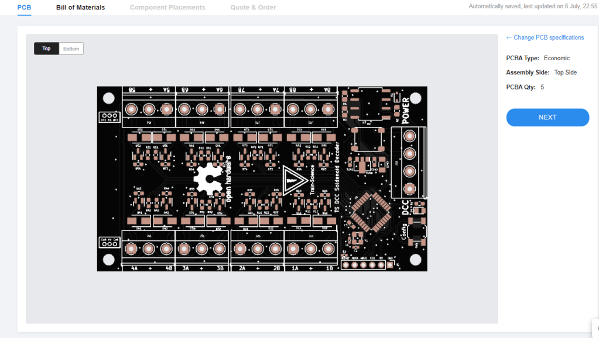
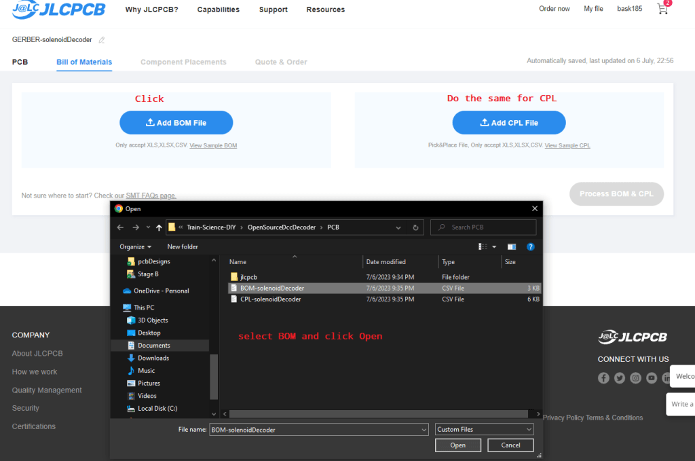
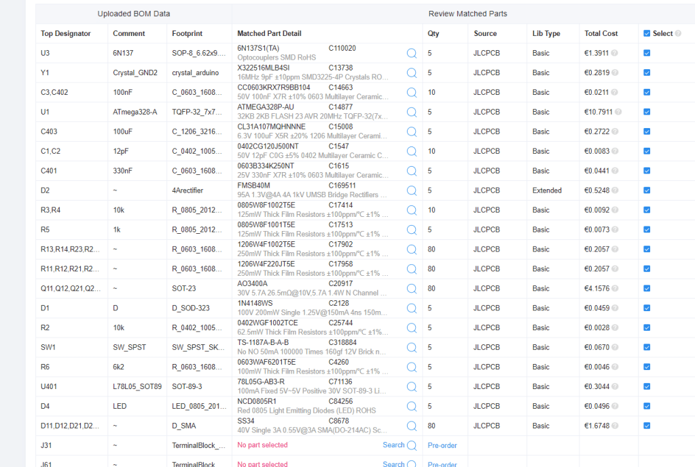
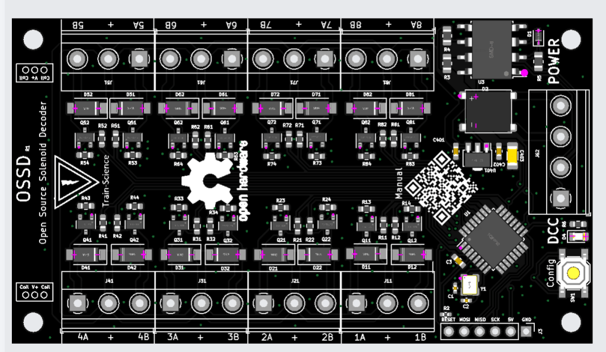
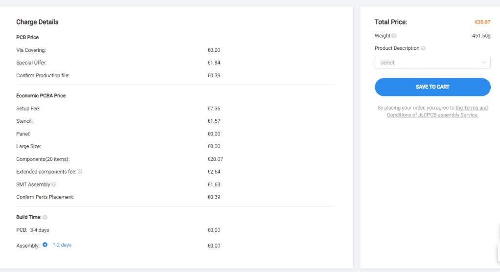
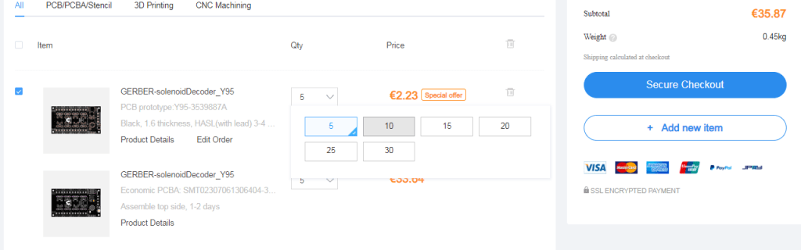
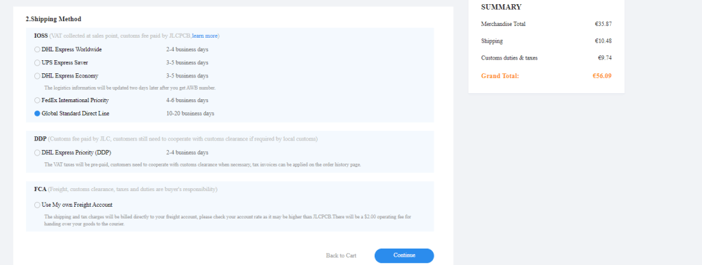

# Ordering Assembled PCBs from JLCPCB

This document explains how to order **assembled PCBs** (with components already soldered) from JLCPCB using the online SMT assembly service.  
It includes all steps from uploading the Gerber files, adding the BOM and CPL, to selecting parts and confirming production.

---

## Step 1 — Visit the Website

Go to [JLCPCB.com](https://jlcpcb.com) and click **“SMT Assembly”**.  
You can either log in or continue as a guest to start the process.

---

## Step 2 — Upload Your Gerber Files

Click **“Add your Gerber file”** and select your design ZIP file.  
This ZIP contains all manufacturing layers, including copper, drill, and mask data.

The preview will load after a few seconds, showing both sides of your PCB.

---

## Step 3 — Configure Board Options

On the configuration screen, you can choose the PCB parameters:  
- Quantity (default: 5 pieces)  
- Color (green, blue, red, black, white, purple)  
- Thickness (1.6 mm by default)  
- Copper weight (1 oz typical)  
- Surface finish (HASL or ENIG)  

If you are ordering an **assembled board**, keep the default copper and surface settings unless your project specifies otherwise.

---

## Step 4 — Select “SMT Assembly”

Enable the **SMT Assembly** option below the preview.  
Choose whether the assembly should be **on the top**, **bottom**, or **both sides** of the board.  
Most projects only use **top-side assembly**.

---

## Step 5 — Upload the BOM and CPL Files

To assemble your board, JLCPCB needs two extra files:  
1. **BOM (Bill of Materials)** — list of all parts with reference designators, values, and part numbers.  
2. **CPL (Component Placement List)** — the position (X/Y) and rotation of each part on the board.

Upload both files when prompted.  
They are usually provided in your project’s release archive or repository.

---

## Step 6 — Verify Component Placement

After uploading the BOM and CPL, a visual tool opens showing the component positions.  
Each component will be marked on the board.

Zoom in and check that every component is placed correctly and matches the silk screen.  
If something looks wrong (rotated 90° or mirrored), fix it in your CAD tool before re-uploading.

---

## Step 7 — Select Components

Next, the system matches your BOM with JLCPCB’s component library (LCSC).  
You can choose between:
- **Basic parts** (always in stock, cheap)
- **Extended parts** (special or less common)

Click **“Confirm”** once all parts are correctly matched.

---

## Step 8 — Confirm the Assembly

A summary will appear showing your part costs, PCB costs, and total price.  
Review all details carefully before confirming.

Check that:
- The number of PCBs is correct.  
- The side to assemble (Top/Bottom) is correct.  
- All components are listed and available.  

---

## Step 9 — Add to Cart

Once satisfied, click **“Save to Cart.”**  
This stores the entire configuration, including your Gerbers, BOM, and CPL, for later reorders.

You can add more designs before proceeding to checkout.

---

## Step 10 — Checkout and Payment

Proceed to checkout.  
Choose your **shipping method**, fill in your **address**, and complete payment via **PayPal** or **credit card**.

Production typically takes **3–5 business days** for assembly, plus shipping time.

---

## Step 11 — Receive Your Boards

Once your assembled PCBs arrive, inspect the solder joints, verify orientation of ICs, and test functionality.  
You now have a professionally manufactured and assembled circuit board — ready to use.

---

### Notes

- Use the same Gerber, BOM, and CPL naming conventions for future orders.  
- You can reorder any previous design from your JLCPCB account dashboard.  
- The online viewer is accurate — if it looks correct there, the boards will match in real life.  

---

*End of document.*
