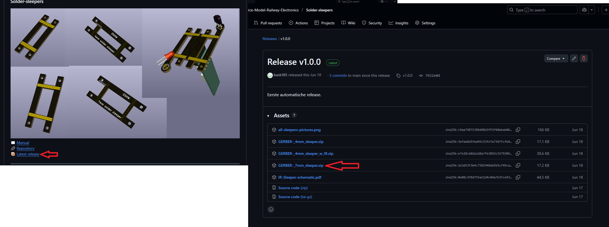
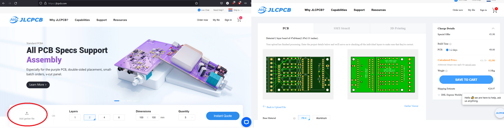
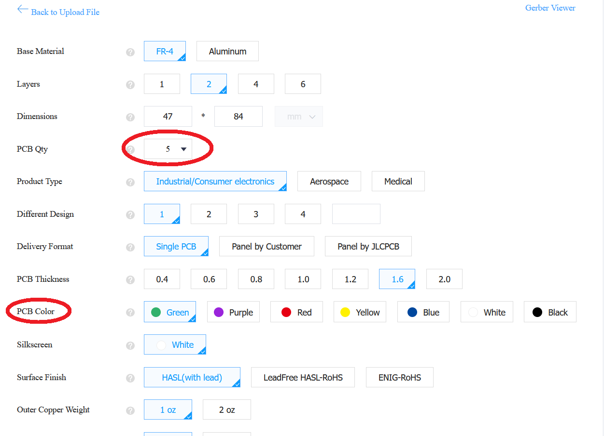
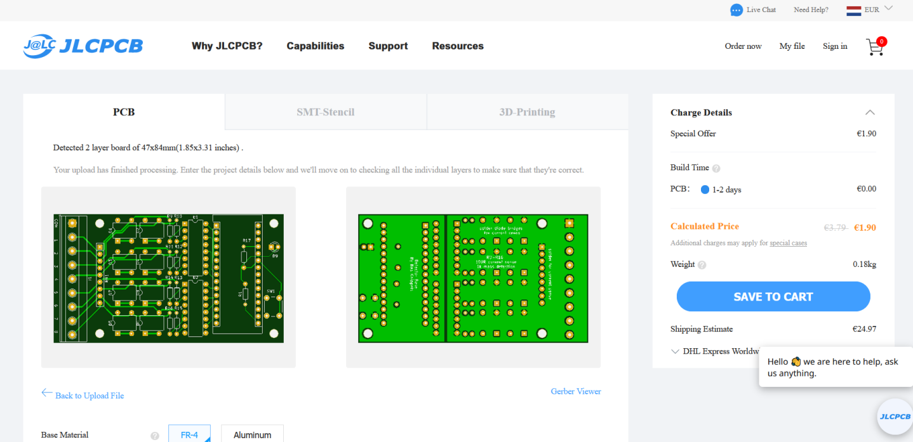
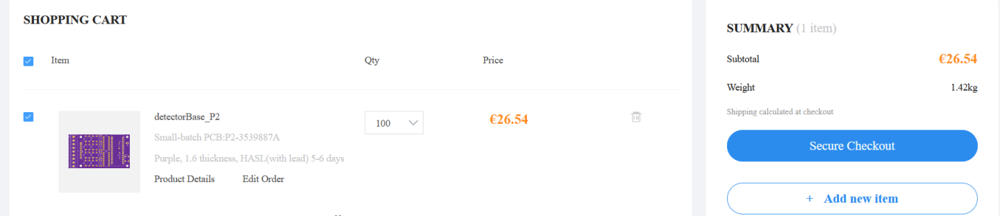
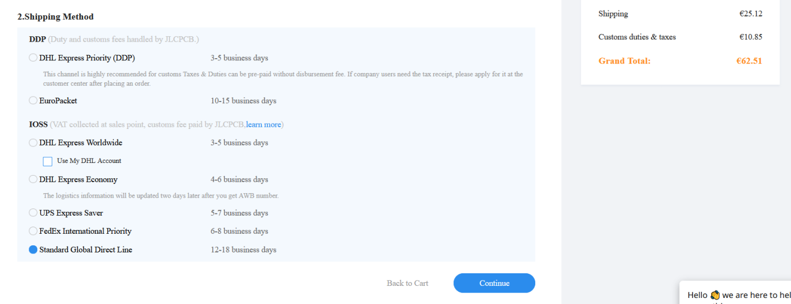

# Ordering a PCB from JLCPCB

Ordering a printed circuit board (PCB) from JLCPCB is one of the easiest things a person can do.  
This guide explains step by step how to order your own board, upload the Gerber files, and receive your finished PCBs.

---

## Step 1 — Go to JLCPCB.com

Visit [JLCPCB.com](https://jlcpcb.com).  
You don’t need any CAD software or extra setup. The entire process happens online.

---

## Step 2 — Download the Gerber Files

To place an order, you need to provide the **Gerber files** of the PCB.  
These files are already prepared for you — you don’t have to create or modify anything yourself.

On your project’s release page (for example, on GitHub), click the **Releases** link of the project you want to order. Inside that section, you will find downloadable files.  

You have two options:

- Download the **“Source code (zip)”** file — it contains everything, including the Gerber files, documentation, and firmware.  
- Or, if you only need the PCB data, click directly on the file named **GERBERS_xxxx.zip**.

Once you have downloaded the ZIP file, go to **JLCPCB.com**, click **“Add Gerber file”**, and select the ZIP you just downloaded.  
It may take a few seconds to upload.

---

## Step 3 — Verify and Configure

After uploading, the website will display a **preview of your PCB**.  
If the board looks correct in the preview, everything is fine.

The first five PCBs you order cost about **$2 in total**.  
If you order more, the price per board becomes lower.

On the same page, you can change several options such as:
- **Board thickness**
- **Copper thickness**
- **Material type**

By default, all settings are already suitable for hobby projects.  
You might want to change only the **quantity** and the **color** of the boards.  
The default thickness is **1.6 mm**, but sometimes you may want a thinner board (for LED strips) or a thicker board (for solder sleepers).

All colors cost the same price, but **non-green colors** (e.g., purple, red, blue) usually take two extra production days.  
Every change you make immediately updates both the price and the 3D preview.

---

## Step 4 — Save to Cart

When you are satisfied with the settings, click **“Save to cart.”**  
You will need a free **JLCPCB account** — this allows you to reorder the same PCB later without uploading the files again.

From your cart, you can add more designs or go directly to checkout.

---

## Step 5 — Checkout and Payment

At checkout, choose your **shipping method**, enter your address, and proceed to payment.  
You can pay by **credit card** or **PayPal**.

Delivery normally takes about **1–3 weeks**, depending on the chosen carrier and your location.

---

## Step 6 — Receive and Assemble

Once your PCBs arrive, solder the components, test your circuit, and enjoy your finished project!  
That’s it — you have successfully ordered your first custom PCB.

---

