# Points & Frogs

This document describes everything you need to know about points motors and frog polarisation. It contains an explanation about the parts of a point, what kind of motors there are, how can you can polarize the frogs to improve pickups and reliability and how you can set an entire route with a single button.

---

## Points

Points, also known as turnouts or switches, are the track components that allow a train to move from one line to another.

It is made up of several key parts:\
- **Stock rails** – the two outer running rails of the turnout.
- **Point blades (switch rails)** – the movable rails that guide the train’s wheels either straight or onto the diverging track. They move together as a pair.
- **Frog** – the part where the two routes intersect.
- **Closure rails** – short connecting rails between the point blades and the frog.
- **Tie bar (or stretcher bar)** – connects the two point blades so they move together when the turnout motor or lever operates.

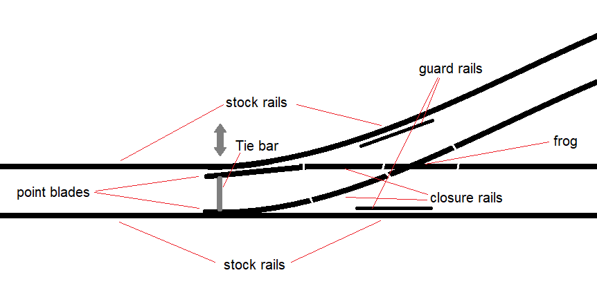

Usually one wants to control the turnout remotely. This can be done as easy as connecting a mechanical rod to the tie bar and to a lever. But most often we use an electrical point motor. There are various types of point motors.

---

## Drives

### Double Coil Drive

The oldest and most well-known type is the **double coil drive**. It consists of two electromagnetic coils and a movable iron core (armature) connected to a sliding bar. This sliding bar is usually connected to the tie bar of a point with or without a spring mechanism.

When a short pulse of current is sent through one of the coils, the magnetic field pulls the armature to one side — moving the point blades via the tie bar. A pulse on the other coil pulls it back the other way.

These drives are fast and powerful, but they require a strong short pulse rather than continuous power, otherwise the coils can burn out. They also produce a sharp *click* sound when operating — which some modellers love for its realism, and others dislike for the noise. Double coil motors are simple, durable, and easy to find, but their mechanical impact can cause wear on delicate turnout mechanisms.

Some of the double coil drives, have mechanical limit switches. This allows one to switch a point using a continuous voltage instead of a pulse. However these switches can eventually be damaged causing them to become a short. When this occurs the motor drive may overheat and also die. To protect the coils from overheating, most modellers use a **capacitor discharge unit (CDU)** to deliver one clean, safe pulse per operation. If a digital DCC decoder is used, the pulse time is also limited. A pulse of 30 ms is usually already enough.

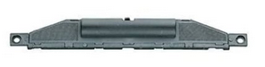
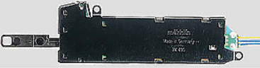

#### Wiring

A double coil drive can be wired to both a digital decoder as well as a mechanical switch. Schematically a double coil drive looks like this:
There are 2 coils and usually also limit switches.

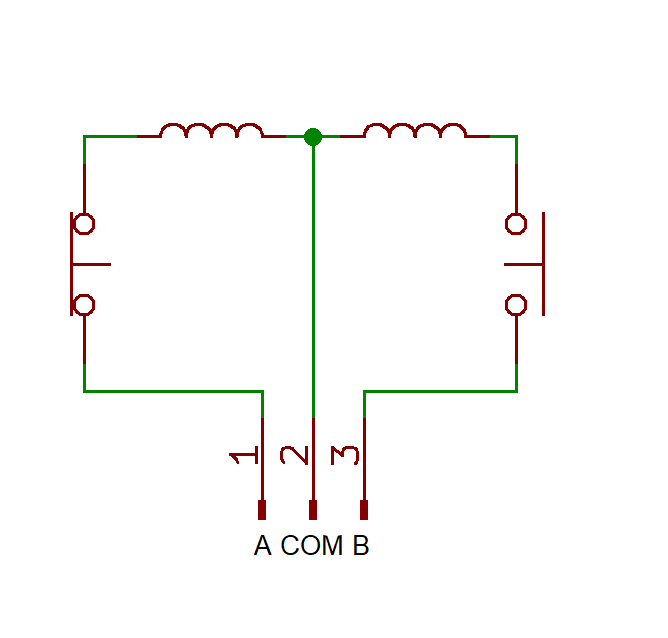 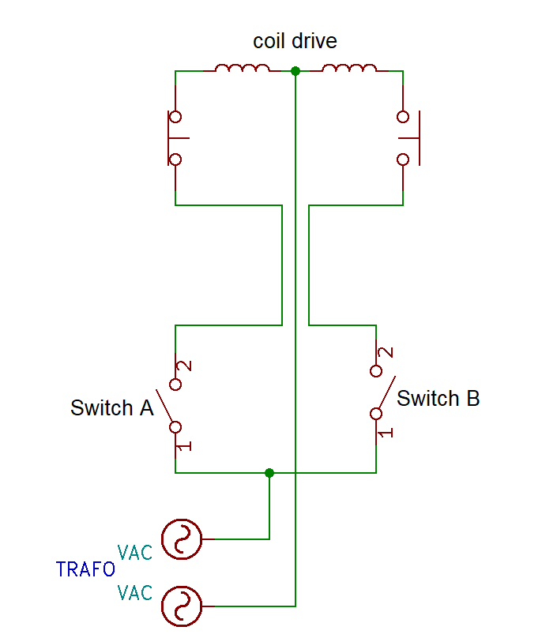

In order to switch the points to either side, you need to energize of the two coils. We typically switch these types with a pulse. With limit switches involved you can also switch continously. But if it happens that the limit switch does not disconnect no more, the coil will burn out.

The modelrailway companies often have dedicated switch units for points. The most well know are of Marklin and Fleischmann. You can also use a miniature toggle switch. They can be bought with a neutral middle position or without.

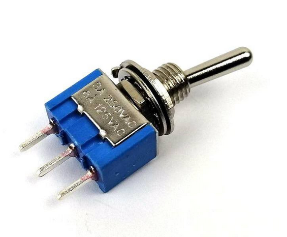 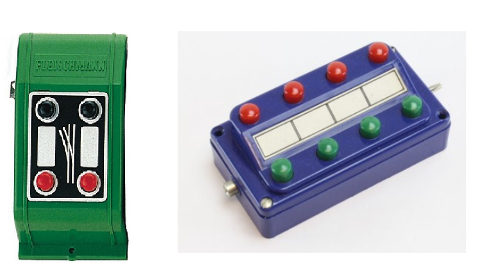

Wiring a double coil drive to these switches can be done as shown below

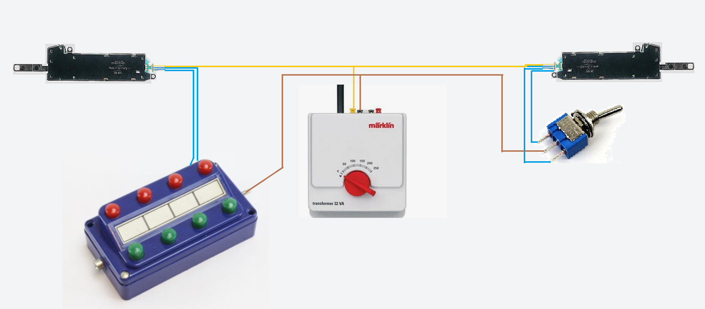

---

## Point Motor

Another type of turnout drive is the **point motor**, often referred to as a *slow-motion motor*. Examples include the **Cobalt IP**, **MTB MP1/MP5**, **OS-Vector**, **Tortoise**, and many others.

Unlike the fast, pulse-driven coil motors, these use a small DC motor with a gearbox to slowly move the point blades from one position to the other. This creates a realistic, smooth motion — similar to a real turnout in the field — and puts much less stress on the tie bar and switch rails.

Inside the housing is a DC motor, a reduction gear train, and a set of limit switches. When power is applied, the motor rotates until it reaches one of the limit switches, which cuts the current and stops the motor automatically. Reversing the polarity makes the motor run in the opposite direction and move the blades back.

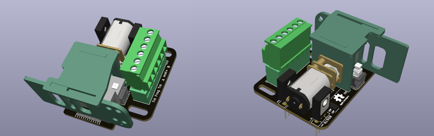

---

## Two-wire Control

In a two-wire system, the motor simply receives DC voltage with reversed polarity to change direction.

You can achieve this by:
- A **DPDT switch** that swaps polarity, or
- Two **diodes** and a control circuit that decides which direction to drive.

This is the simplest and most common method for analog layouts or when using digital accessory decoders designed for slow-motion motors.

The advantage of two-wire control is that you just need 2 wires. And besides the limit switches, only 2 diodes are needed for this to work. The disadvantage is that the switch needs to be a double pole one, because it needs to invert the polarity. You also need to use extra electronics to connect such a motor to a decoder.

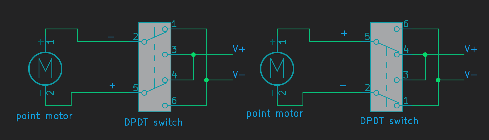

---

## Halve Sine Control

There is something special you can do with two-wire control that is known as **halve sine control**. It is a method where you can connect one of the motor leads to a common rail. The double pole switch can be replaced with a single pole and one needs to make use of an AC voltage source. One drawback is that the switch itself needs two diodes.

Because of the common rails to the switches and to the motors, the 2-wire motors actually need 1 wire between motor and switch. This simplifies the wiring.

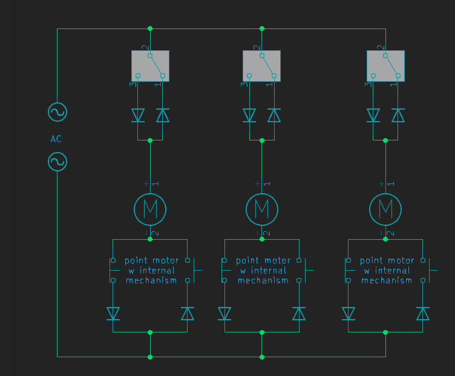

How it works:
- **Scenario 1:** the motor is idle. One direction is blocked by diodes, the other by a limit switch.  
- **Scenario 2:** the switch is thrown. Current flows through the upper diode, through the motor, back to the voltage source.  
- **Scenario 3:** the motor reaches its limit switch, blocking the current again.  
- **Scenario 4:** the switch is thrown again, current flows in the opposite direction until the next limit switch is hit.

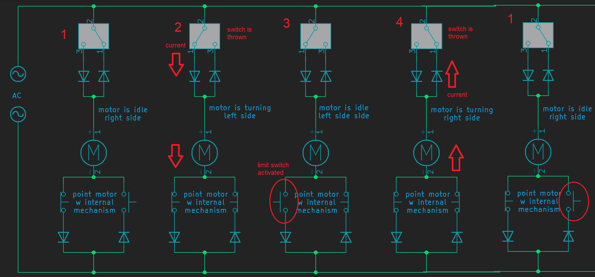

---

## Three-wire Control

Some motors (like the MTB MP1 or earlier designs) use three wires: one **common positive** and two **direction inputs**. Each input powers the motor in one direction through internal diodes — this allows electronic switching with simple transistors or relays, without needing to reverse the supply polarity.

The advantage of three-wire control is that it is compatible with most types of digital decoders, where two-wire control is not. You can also use a single pole double throw switch instead of a double pole variant. The disadvantage is that such a motor uses a little bit more electronics, and there is a third wire involved.

Another advantage is that these motor can also be controlled with a miniature toggle switch. They can also be switched with a pulse if the pulse last long enough. These kind of motor typically need a second or two to fully switch.

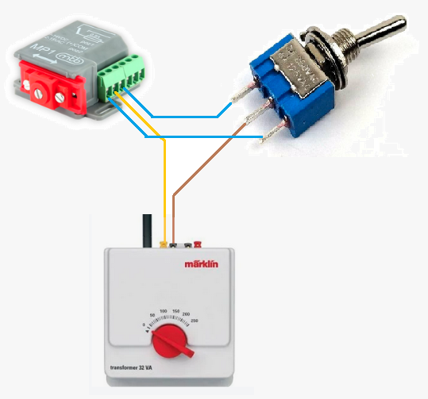

---

## Wiring to a decoder

Both double coil drives as well as three-wire Point motors can usually be connected to a DCC decoder. In this example an OS-Solenoid Decoder is used. It would be needed for the MP1 to have different settings then for the double coil drive.

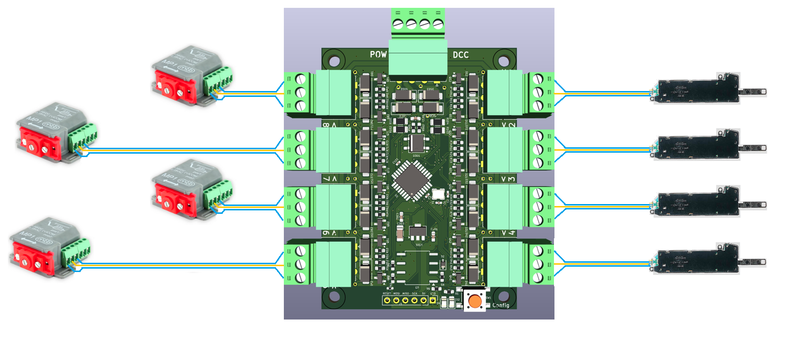

## Wiring to a diode matrix

One great benefit of both double coil drives as well as three-wire motors is that you can set entire routes with just 1 button. We can do so using the diode matrix method. In this example we have 3 double coil drives for 3 points and 4 tracks. With one press on one of the four switches we can set all 3 points in the correct position.

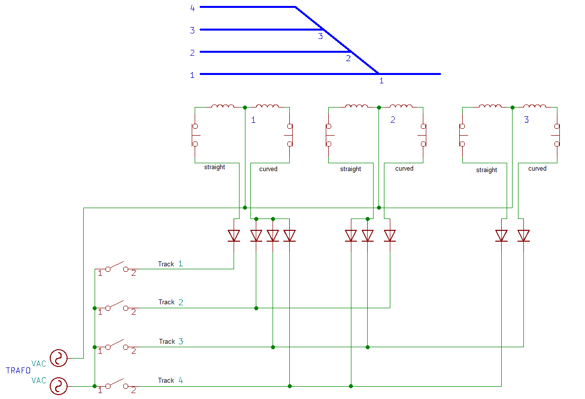

You can use the [OS-Diode Matrix](https://github.com/Open-Source-Model-Railway-Electronics/Analog-Layout-Control) PCB to easily make a diode matrix

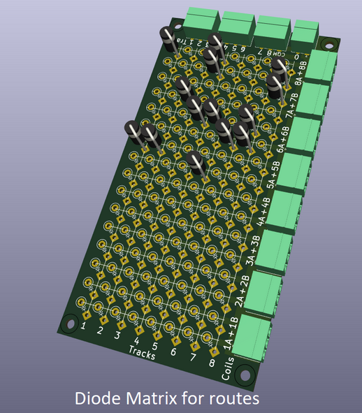

## Servo Motor Drive

A **servo motor** is a small, lightweight actuator widely used in model railways for turnout control. Originally developed for radio-controlled models, servos are inexpensive, precise, and easy to control electronically.

A servo contains three parts inside:
- A **DC motor**
- A **gearbox**
- A **position feedback potentiometer** connected to the output shaft

The internal electronics continuously compare the commanded position with the actual position and drive the motor until both match. This feedback makes the servo extremely accurate — ideal for the delicate movement of point blades.

A servo is driven by a control signal, not by direct power polarity. It uses a short, repeating control pulse that tells the internal electronics what position to move to. Unlike DC or AC drives, the servo always receives a constant power supply, and the signal line defines the desired position.

### Advantages of Servo Drives
- Very slow, realistic motion — the movement speed can be adjusted in software.  
- Precise positioning — fine-tune the end points.  
- Compact and lightweight — fits under or beside the track.  
- Quiet operation — no clicking or mechanical impact.  
- Flexible control — can be driven by microcontrollers or servo decoders.

### Limitations
- Servos need a continuous control signal — if it stops, the servo may drift or buzz.  
- Cheap servos can jitter if powered by noisy supplies.  
- They require a controller or decoder to generate the control pulses; they can’t be operated directly with a simple switch.

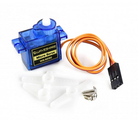

---

## Frogs

Besides motors and drives used to move points, there is another important concept to understand: **frog polarization**.

In short: specifically for 2-rail layouts, it is sometimes necessary to polarize the frog of a point. The frog is electrically connected either to one rail or to the other, depending on whether the point is set to straight or diverging. This improves current collection so that even small 2-axle locomotives can crawl over without stalling. Whether this is necessary depends on the type of point — there are **insulfrogs**, **unifrogs**, and **electrofrogs**.

### Insulfrog

With an insulfrog, the frog is non-conductive (often plastic). Metal insulfrogs also exist. An insulfrog simply cannot be polarized easily. The advice is: if you run many small 2-axle locomotives, avoid using this type of point. It is possible to modify such a point to become a unifrog using conducting paint.

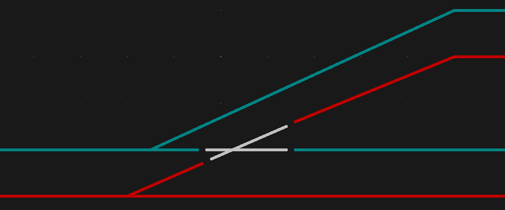

### Unifrog

A unifrog is completely insulated like an insulfrog but is conductive and usually has a solder tab for polarization. This type is designed to be polarized, and you should do so.

Unifrogs are easiest to polarize using a single relay that connects the frog to either rail. Another option is a **frog juicer** — a small device that detects a short circuit and reverses polarity instantly (within microseconds).

Some point motors have built-in mechanical frog polarization. This is often found in modern motors, though some older solenoid drives also included this feature.

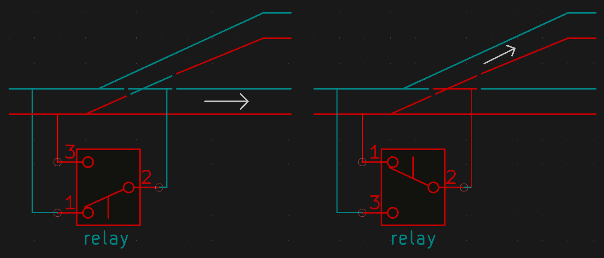

### Electrofrog

With an electrofrog, the frog and both point blades are electrically connected to each other. The frog is powered by one of the two blades, depending on which one touches its stock rail. A small spring keeps the blades pressed firmly against either rail.

The advantage: built-in polarization without modification. However, dirt and paint can make contact unreliable, so modellers often add external frog polarization anyway — sometimes removing the spring for quieter movement.

The easiest way to add extra frog polarization to an electrofrog is again by using a frog juicer. Polarizing with a single relay is possible but risky: it must only switch when the blades are halfway. Most servo decoders handle this automatically. A safer method is to use **two relays**, so the decoder can first disconnect the frog, move the blades, and then reconnect the correct polarity.

Even for electrofrogs, some point motors can provide polarization via mechanical contacts. Servo brackets can also add switches for this purpose.

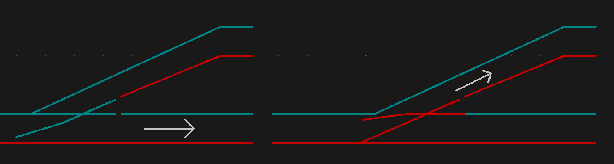
