# Flashing an OS Decoder with firmware

## Prelude
Programming any OS decoder has to be done via a method which is called **In Circuit Serial Programming** (ICSP for short). The Arduino website has a very elaborate explanation how that works and how you can do this. I have a shorter tutorial however. It does involve using a computer.

One final note. This page was originally written for the first decoder named **OSSD**, but the process is the same for all OS decoders and every other Open-Source design that require firmware.

---

## Step 1: Download the necessary files.
The firmware that is going to be flashed on the OS-decoder is a so called binary file. You can recognize them by the `.hex` extension. All officially released binaries are to be found on this website:
`https://github.com/Open-Source-Model-Railway-Electronics/OS-software-tool`

In order to obtain the software you need to download the entire repository. You can click on the green **Code** button and click **Download ZIP**.

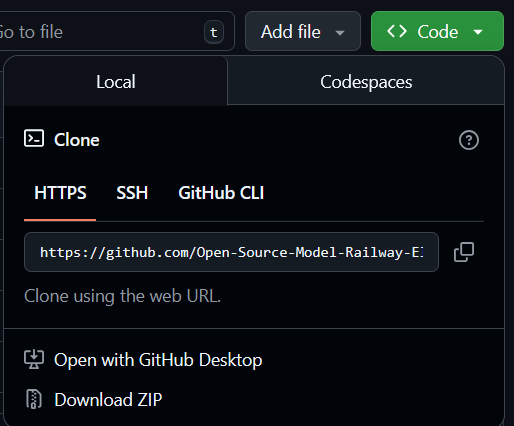

---

## Make the connections
An OS-decoder cannot be connected to a computer directly. In order to do this we need to use an **Arduino** board.

The first thing we must do is to make the connections between Arduino and decoder. **Make sure that the Arduino is not plugged into the computer while you connect the wires.**

Every decoder has an **ICSP** connector for programming. In order to connect the wires you could solder a conventional pin connector on it. The pins are marked so it should be easy to hook it up to an Arduino. You can simply use **dupont** wires for this. Alternatively you can purchase a so called **pogopin clamp**. This allows you to program without the need of a soldering iron.

You need to make the following 6 connections between decoder (**OSSD** in this case) and Arduino board:

| OSSD (ICSP) | Arduino (UNO) |
|---|---|
| 5V   | 5V   |
| GND  | GND  |
| SCK  | D13  |
| MISO | D12  |
| MOSI | D11  |
| RESET| D10  |

An early OSSD model connected to the Arduino programmer. When the Arduino is connected to the decoder you can plug it in the computer via a USB cable.

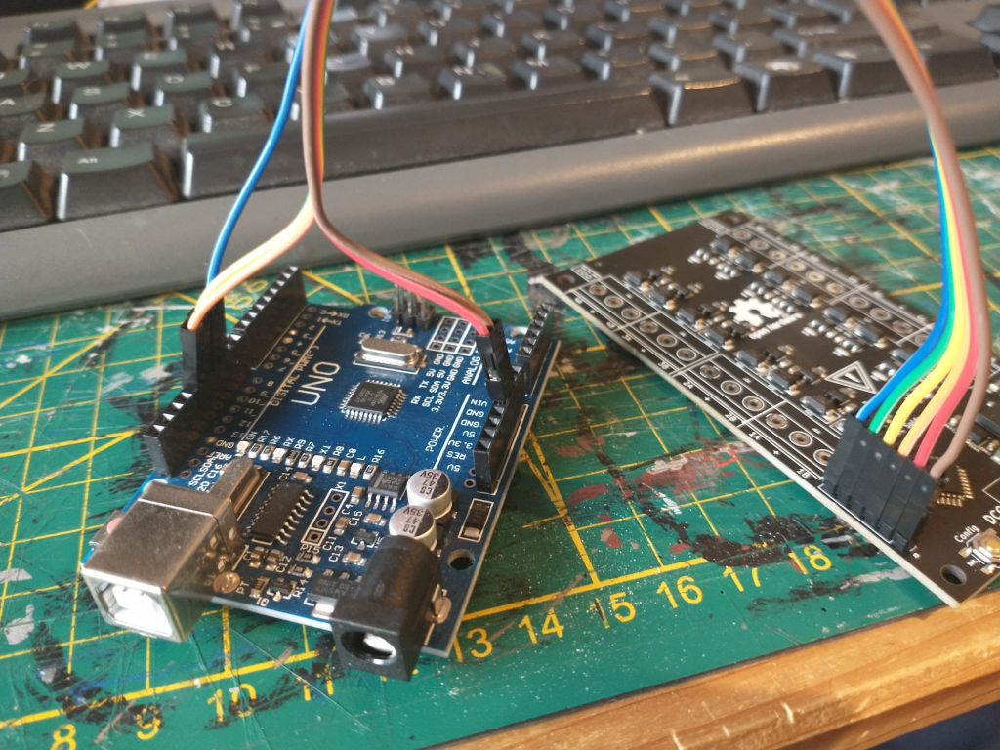

If you intend to do this often you may consider buying a **1×6 pogo pin clamp** in **0.1″ / 2.54 mm** pitch. With it you don’t have to ‘do’ the wires and solder the program connector. This clamp has conical pins which are pressed against the program connector with a spring.

A fully assembled OSSD programmed via pogopin clamp.

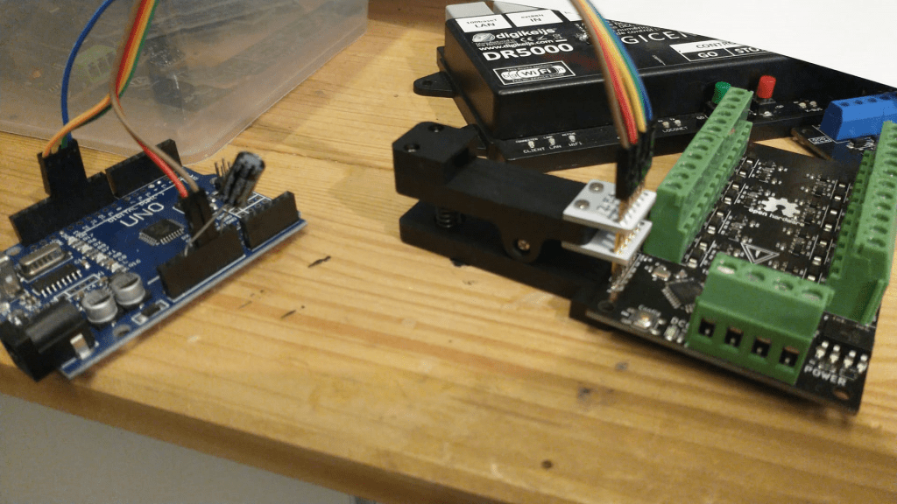

---

## Flash the ArduinoISP program
The second thing we need to do is turn this Arduino board into a programmer by flashing Arduino’s **ArduinoISP** program into the board. When that is done we can use the Arduino board to program the OSSD.

For both programming the Arduino and a decoder there is an easy way and a slightly less easy way. **The easy way is as simple as dragging `ArduinoISP.hex` over `UPLOAD_PROGRAM.bat`.** The `upload_program` batch file can automatically detect an Arduino when it is connected to the PC via USB. It will then flash the hex file into the Arduino, turning it into a fully fledged programmer device.

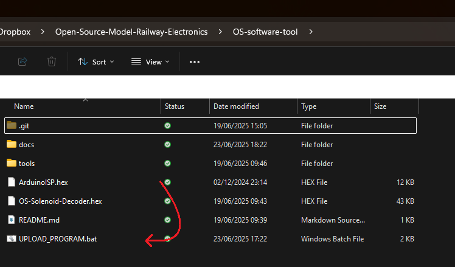

This was the easy way—drag one file over another. It could be however that something goes wrong and it does not work for whatever reason. In this case we can fall back to **plan B**.

The plan B way involves downloading and installing the **Arduino IDE** on your computer. It is a fairly simple process—you can surf to *arduino.cc*, click **Software** and navigate down to **Arduino IDE 1.8.19**. Once installed you need to open the example sketch named **ArduinoISP** and flash it into the Arduino board.

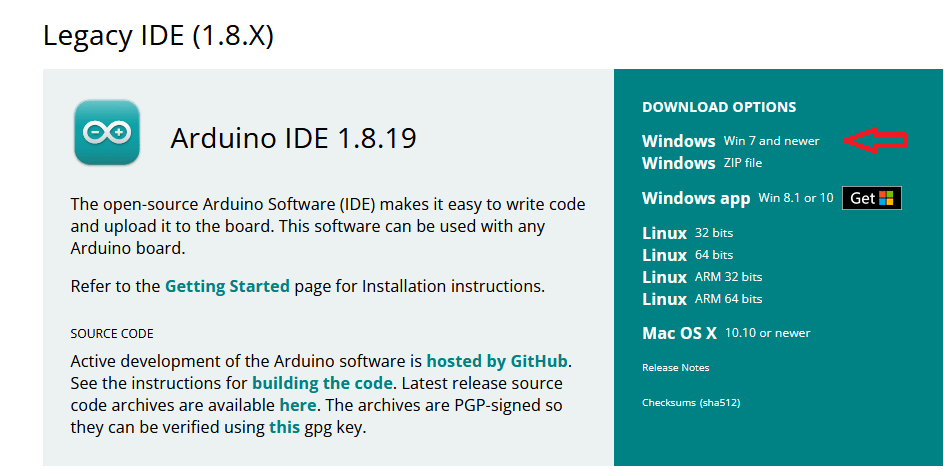

Open **ArduinoISP** sketch in the IDE. Make sure to set the **COM port** and **board** settings right. You can see which COM ports are available in the IDE—it is usually the bottom one. Set board type to **UNO** (or **NANO** depending on what you bought).

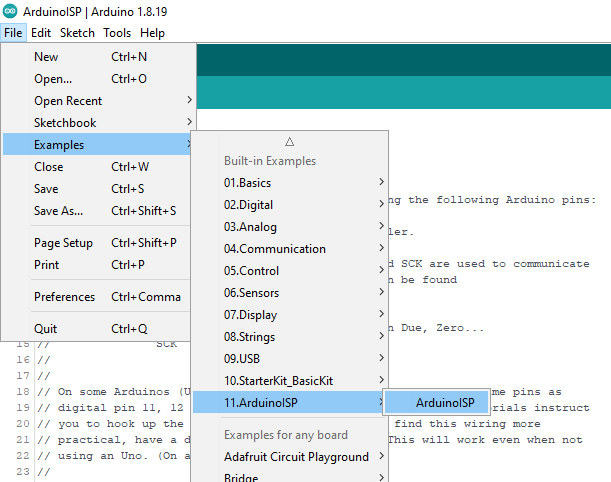

Set Board and COM port settings right. Finally click on the upload arrow or hit **Ctrl + U**.

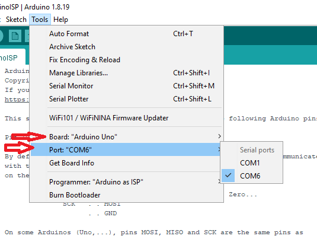

Arduino UNO being programmed as ICSP programmer. When the Arduino is programmed it is almost ready to be used as programmer. You need to put in a **capacitor** in the Arduino (**10 µF or more**). The long leg (+) should go in the **RESET** pin and the short pin (–) should go in a **GND** pin. This capacitor prevents the Arduino from being reset when we try to program the decoder.

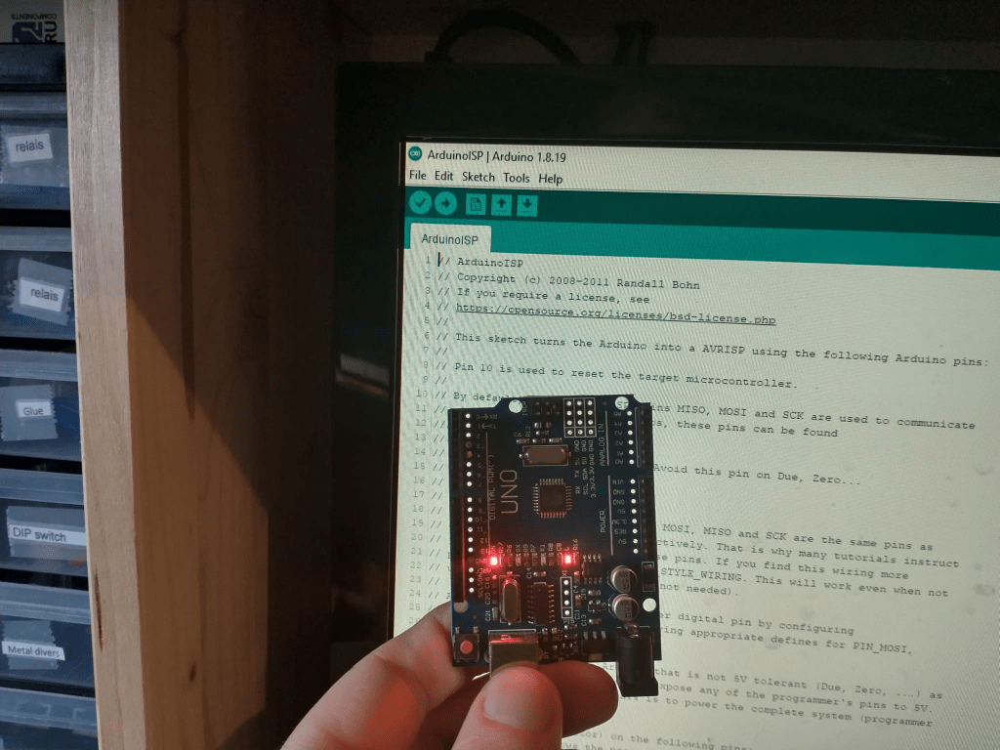

Added capacitor. Once you have successfully programmed the Arduino board with the ISP program, made all the proper connections and inserted the capacitor, the programming of the decoder can now commence!

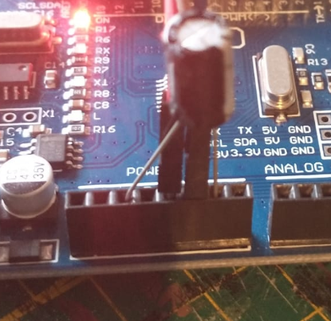

---

## Flash the Decoder
Like before there is the easy way and the plan B way. Again the easy way consists of dragging a **decoder `.hex` file** over the **`UPLOAD_PROGRAM.bat`** script. If that goes well you should see a similar result as before.

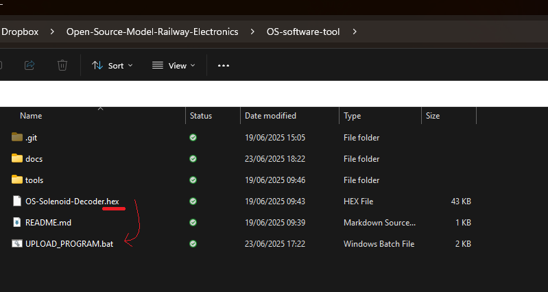

> **Note #2.** It can occasionally happen that the upload process sometimes fails. Sometimes it tosses an error; sometimes it does not give an error and the board won’t work. When it happens, just keep trying it again until it does work.

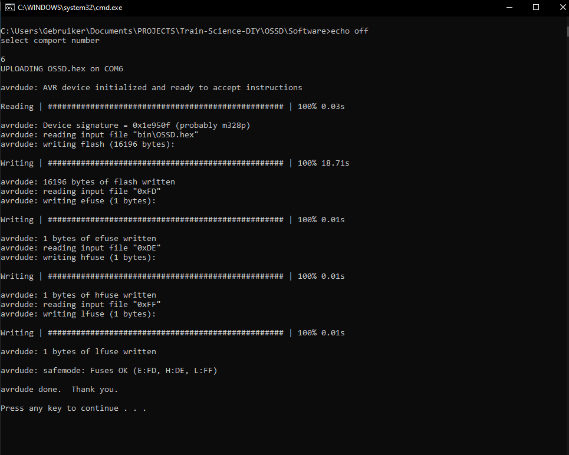

With the **Arduino IDE method (plan B)**, you need to do 2 steps. Before you program the board with a **Decoder** program, you’ll first need to **burn the bootloader**. This is also explained on the Arduino website. It is incredibly simple… You can just click on **Tools → Burn Bootloader**. Also make sure that **Board** and **Port** settings are correct.

Extra information: The bootloader is usually needed for an Arduino to allow programming via USB. However it is also important because it sets the **ATmega’s fuse bits** to work with the correct clock frequency. If you don’t do this the decoder will operate at **1/16 speed** and won’t be able to decode a single DCC message.

When the bootloader is burned you must open a decoder project in the Arduino IDE. For this to happen, you do not need the binary hex file, but the actual **source code**. On GitHub navigate to the appropriate decoder, go to its repository, press the green **Code** button and click **Download ZIP**.

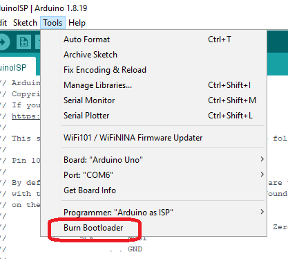

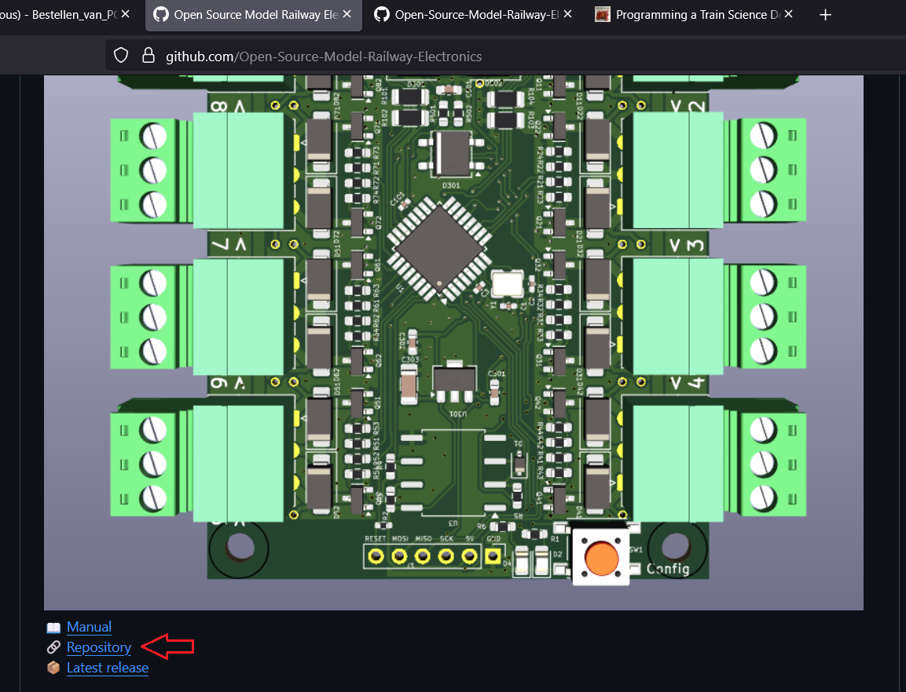
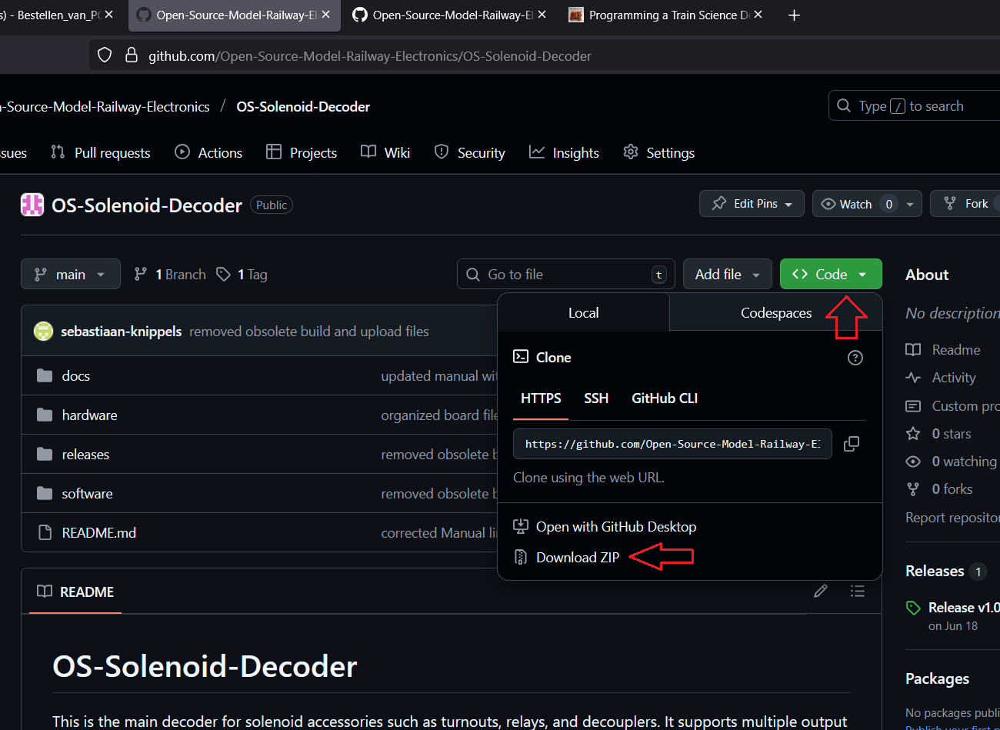

Afterwards unzip the folder. You should then see a **software** folder. In it there is a file called **software.ino**. Double click on the `software.ino` file. This should open the IDE for you with the desired program open. This is what you should see now.

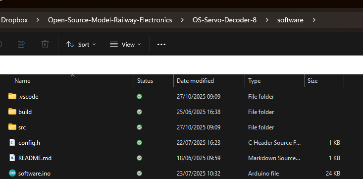
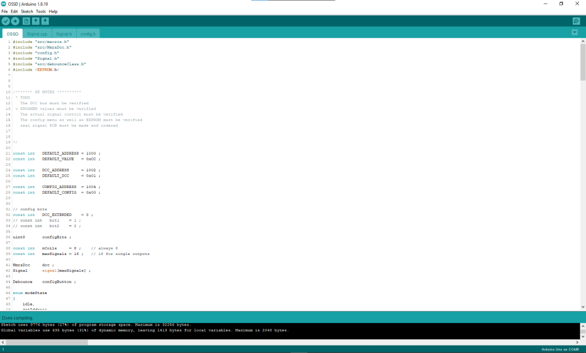

In order to program a Decoder program into the Decoder we won’t be using the conventional **Upload** method with the arrow. You need to tell the IDE that we will be using an **Arduino as ISP** programmer. You can do so by clicking on **Tools → Programmer → Arduino as ISP**. Then you must click on **Sketch → Upload Using Programmer** (or simply hit **Ctrl + Shift + U**).

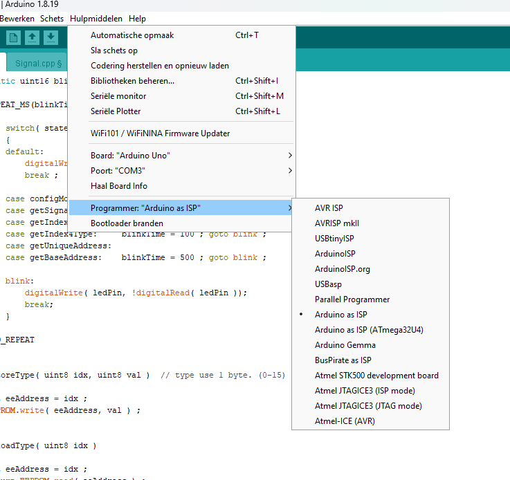
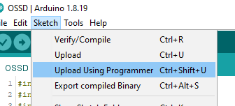

Doing so will let the Arduino IDE first compile the program and flash it into the Decoder. If you see this message in the bottom of the IDE, you are done:

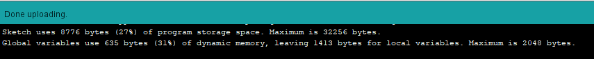

---

### End of document
