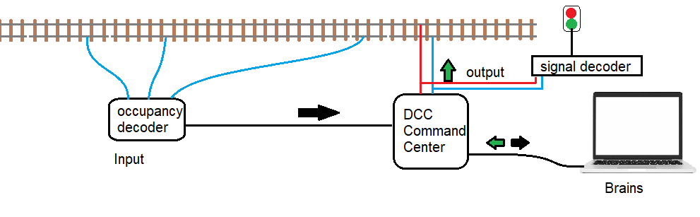
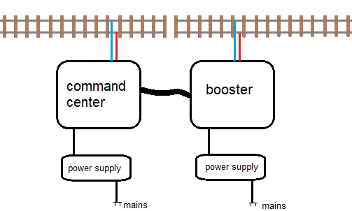

# Automatisierung Ihrer Modellbahnanlage (für Einsteiger)

---

## Vorwort

Modelleisenbahnen waren schon immer mehr als nur Züge, die im Kreis fahren. Sie sind Miniaturwelten – vollständige Systeme aus Bewegung, Signalen und Logik. Damit diese Welt realistisch funktioniert, brauchen wir Automatisierung.  
Automatisierung bedeutet, dass die Züge wissen, wo sie sich befinden, Signale automatisch wechseln und Fahrstraßen sich selbst einstellen, ohne dass jemand einen Schalter betätigt. Für viele Modellbahner klingt das nach Magie – oder nach etwas, das nur Ingenieure verstehen. Das ist es nicht.  
Dieses Handbuch erklärt Schritt für Schritt, wie die digitale Modellbahn-Automatisierung wirklich funktioniert. Es beginnt mit den absoluten Grundlagen – was ein Eingang, ein Ausgang und ein Block ist – und führt bis zur vollständigen digitalen Steuerung mit Computern, Boostern und Rückmeldungen.  
Es sind keine tiefgehenden Elektronikkenntnisse erforderlich – nur Neugier und ein wenig Geduld. Jedes Kapitel konzentriert sich auf das Verständnis, nicht auf das Auswendiglernen. Wenn Sie wissen, warum etwas getan wird, wissen Sie auch, wie Sie es beheben, wenn es nicht funktioniert.  
Das Ziel ist, Ihnen das Vertrauen zu geben, Ihre eigene Anlage mit klarem Kopf zu verdrahten, zu testen und zu automatisieren – ohne Angst vor Fehlern. Automatisierung bedeutet nicht, dass der Computer mit Ihren Zügen spielt – sie bedeutet, eine Anlage zu bauen, die sich wie eine echte Bahn verhält: organisiert, sicher und lebendig.

---

## Inhalt

1. Grundkonzepte  
2. Digitale Steuerung in Kürze  
3. Rückmeldesysteme (Belegtmeldung)  
4. Zubehördecoder  
5. Verdrahtung & Infrastruktur  
6. Booster & Stromverteilung  
7. Testen & Fehlersuche  

---

## Kapitel 1 — Grundkonzepte

Bevor man in digitale Systeme oder Verdrahtung einsteigt, ist es wichtig, die grundlegenden Bausteine einer automatisierten Modellbahn zu verstehen. Alles verbindet sich mit drei Hauptelementen: **Eingänge**, **Ausgänge** und **Logik**.

### Eingänge
Eingänge sind die Augen und Ohren Ihrer Anlage. Sie teilen dem System mit, was passiert – Sensoren, Taster oder Rückmeldesignale von Weichen. Eingänge steuern nichts direkt; sie liefern nur Informationen.

### Ausgänge
Ausgänge sind die Hände Ihrer Anlage. Sie reagieren auf Befehle: Weichenantriebe, Signale, Relais oder Lokdecoder.

### Logik oder Steuerung
Die Logik ist das Gehirn zwischen Eingang und Ausgang. Sie entscheidet, was als Nächstes geschehen soll.  
Drei übliche Formen der Logik sind:
1. **Manuelle Steuerung** – Sie entscheiden.  
2. **Computersteuerung** – Software wie Rocrail, iTrain, Train Tastic oder TrainController entscheidet automatisch.

Wenn Ihre Anlage automatisiert ist, übernimmt der Computer die Logik, und die Zentrale wird zur Kommunikationsbrücke.

### Blöcke und Abschnitte
Ein **Block** ist ein Gleisabschnitt, in dem sich jeweils nur ein Zug befinden darf. Ein **Abschnitt** ist ein kleinerer Teil innerhalb eines Blocks, der zur Erkennung dient (Einfahrt, Halt oder Ausfahrt). Es gibt verschiedene Arten, einen Block aufzubauen, aber im Wesentlichen besteht ein Block aus drei Abschnitten: Einfahrabschnitt, Mittelabschnitt und Halteabschnitt.  
Wenn der Block in beide Richtungen befahren werden kann, können Einfahr- und Ausfahrabschnitt vertauscht werden. Die Grundidee ist: Wenn ein Zug den Einfahrabschnitt befährt, beginnt er zu bremsen. Er kann im Mittelabschnitt anhalten. Wenn der Zug überfährt und den Halteabschnitt erreicht, wird er stärker abgebremst. Den Mittelabschnitt an einen Belegtmelder anzuschließen ist nicht unbedingt notwendig, kann aber helfen, lose Wagen zu erkennen.

### Decoder
Decoder übersetzen digitale Befehle in Aktionen. Es gibt zwei Haupttypen:
- Lokdecoder (mobile Decoder)  
- Zubehördecoder (stationäre Decoder)

Jeder Decoder hat seine eigene digitale Adresse. Die Zentrale verwendet diese Adressen, um jeden Decoder einzeln anzusteuern.

### Zentraleinheit
Die Zentrale (Command Station) ist die Verbindung zwischen Computer und Gleis. Sie sendet DCC-Signale an alle Lok- und Zubehördecoder und überträgt Rückmeldungen an den Computer.

---

## Kapitel 2 — Digitale Steuerung in Kürze

Wenn ein Zug in einen Block einfährt:
1. Der Melder erkennt die Belegung.  
2. Der Melder sendet sie über den Rückmeldebus an die Zentrale.  
3. Die Zentrale leitet sie an den Computer weiter.  
4. Der Computer entscheidet – Zug anhalten, Signal ändern, Fahrstraße stellen.  
5. Er sendet DCC-Befehle zurück an die Zentrale.  
6. Die Zentrale überträgt sie an die Anlage.  
7. Der betreffende Decoder reagiert.

Dieser Rückkopplungskreislauf – **erkennen → entscheiden → handeln** – hält alles koordiniert.

| Rolle | Funktion | Beispiel |
|------|-----------|----------|
| Melder | Erkennt Zugpräsenz | Strom- oder Massemelder |
| Zentrale | Überträgt Daten | Z21, DR5000, ECoS |
| Computer | Trifft Entscheidungen | Rocrail, iTrain |
| DCC-Signal | Überträgt Daten | Gleisverdrahtung |
| Decoder | Führt Befehle aus | Lok- oder Zubehördecoder |

---

## Kapitel 3 — Rückmeldesysteme (Belegtmeldung)

Melder sind die Augen der Automatisierung. Sie teilen dem System mit, ob ein Abschnitt belegt oder frei ist.

### Methoden
- **Stromerkennung**: erkennt kleine Stromaufnahme über die Schiene. Zuverlässig für angetriebene Fahrzeuge.  
- **Masseerkennung**: erkennt Achsüberbrückung zwischen den Schienen. Günstiger, aber weniger zuverlässig.

### Blöcke und Abschnitte
Teilen Sie die Anlage in logische **Blöcke** und **Erkennungsabschnitte** (Einfahrt, Halt, Ausfahrt). Jeder Block sollte mindestens einen Rückmeldeeingang haben.

### Bus-Kommunikation
Gängige Bus-Systeme: **S88**, **LocoNet**, **CAN**, **RS-Bus**. Melder und Zentrale müssen dasselbe Protokoll verwenden.

### Beste Praxis
Bauen und testen Sie **einen Block nach dem anderen** – fügen Sie weitere hinzu, wenn jeder korrekt funktioniert.

---

## Kapitel 4 — Zubehördecoder

Zubehördecoder steuern alles außer den Lokomotiven: Weichen, Signale, Relais usw.

### Typen
- **Weichendecoder** – steuern Weichenantriebe (Spulen, Servos oder Motoren).  
- **Signaldecoder** – steuern mehrbegriffige LEDs oder Formsignale.  
- **Relaisdecoder** – schalten Strom, Beleuchtung oder andere Lasten.

### Adressierung
Jeder Ausgang hat eine digitale Adresse. Planen und dokumentieren Sie alle Adressen klar, um Verwechslungen zu vermeiden.

### Stromversorgung und Sicherheit
Verwenden Sie, wenn möglich, separate Spannungsversorgungen für Zubehör. Fügen Sie Sicherungen oder Polyfuses hinzu, wenn mehrere Decoder denselben Bus nutzen.

---

## Kapitel 5 — Verdrahtung & Infrastruktur

Gute Verdrahtung ist das Rückgrat der Zuverlässigkeit.

### Richtlinien
- Verwenden Sie einen **Leitungsbus** mit Einspeisungen alle 1–2 m.  
- Bevorzugen Sie **Sternverdrahtung** für ein stabileres System.  
- Beschriften Sie beide Enden jedes Kabels.  
- Verwenden Sie Aderendhülsen, keine verzinnten Enden, in Schraubklemmen.  
- Trennen Sie Gleisspannung, Rückmeldung und Beleuchtungskabel.  
- Fügen Sie **Sicherungen** pro Stromkreis hinzu.  

Gute Verdrahtung ist unsichtbar, wenn sie funktioniert – unvergesslich, wenn nicht.

---

## Kapitel 6 — Booster & Stromverteilung

Wenn die Anlage wächst, kann eine einzige Zentrale nicht alles versorgen. **Booster** teilen die Leistung in isolierte Abschnitte auf.

### Booster-Funktionen
- Verstärken das DCC-Signal für ihren Abschnitt.  
- Bieten Kurzschlussschutz pro Abschnitt.  

Jeder Versorgungsabschnitt hat seinen eigenen Booster, seine eigene Versorgung und Sicherung. Zubehör sollte über eine separate, geregelte Stromleitung betrieben werden.

Booster liefern normalerweise etwa 3,5 A Strom. Ein durchschnittlicher Zug verbraucht etwa 500–700 mA während der Fahrt. Dies variiert je nach Zug und z. B. der Beleuchtung der Wagen. Ein Booster kann also etwa vier Züge versorgen.

---

## Kapitel 7 — Testen & Fehlersuche

Selbst die beste Verdrahtung kann Fehler haben. Fehlersuche bedeutet, systematisch zu arbeiten.

### Schritte
1. **Früh testen, oft testen** – jedes Modul beim Einbau prüfen.  
2. **Visuell prüfen** – die meisten Fehler sind mechanisch.  
3. **Multimeter verwenden** – Spannung, Durchgang und Widerstand prüfen.  
4. **Kurzschlüsse finden** – abschnittsweise isolieren.  
5. **Rückmeldung prüfen** – Bustyp und Stromversorgung kontrollieren.  
6. **Decoderprobleme** – Adressen und Spannungen prüfen.  
7. **Fahrzeuge** – Räder reinigen, Widerstandsachsen verwenden.  
8. **Protokoll führen** – Fehler und Lösungen notieren.  
9. **Wartung** – Schrauben nachziehen, Steckverbindungen prüfen, Blöcke erneut testen.

| Problem | Typische Ursache | Lösung |
|----------|------------------|--------|
| Stromausfall | Kurzschluss oder lose Leitung | Abschnitt isolieren und prüfen |
| Keine Rückmeldung | Falsche Verdrahtung | Eingang manuell testen |
| Decoder reagiert nicht | Falsche Adresse | Neu programmieren |
| Falsche Belegung | Schmutzige Räder | Gleis reinigen |

---

## Abschließende Übersicht

Automatisierung ist einfach ein strukturierter Kreislauf: **erkennen – entscheiden – handeln**.

### Prinzipien
- Eingänge erkennen.  
- Logik entscheidet.  
- Ausgänge handeln.  
- Die Zentrale verbindet alles.

### Ergebnis
Eine digitale Anlage wird sicherer, intelligenter, wartungsfreundlicher und realistischer – sie wirkt, als denke sie selbst.

---

*Ende des Dokuments.*
