# Design your own custom LED Strips. {#ontwerp-je-eigen-custom-led-printen. .western}

------------------------------------------------------------------------

On this page I give a bare‑minimum crash course in KiCad, the program I use to make all my PCBs. In this crash course I only explain the essentials to make an LED strip. KiCad can do an incredible amount, but you only need a small fraction to make a simple little LED strip.

Why go through the trouble yourself if you can buy ready‑made strips? Because there’s such a thing as “compartment coaches.” Anyone who has ever installed lighting in a compartment coach knows the problem: the LEDs on a standard LED strip never sit nicely in the middle of the compartments. One compartment might be better lit than another, and your corridor can be dark.

So for this coach you really want just one LED strip. And that’s the LED strip specifically designed for this coach.

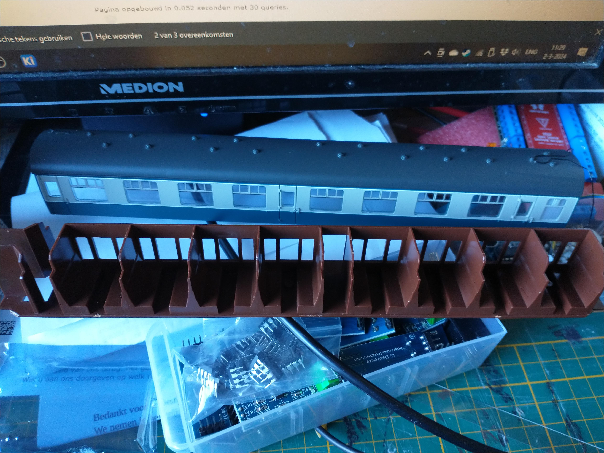{#Image1 width="662" height="371" border="0"}

And that is this one

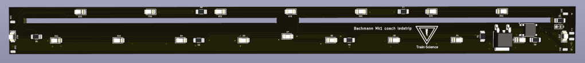{#Image2 align="bottom" width="691" height="75" border="0"}

All LEDs are centered in the compartments, and the corridor and vestibules are illuminated as well.

I also use SMD components that I’ll solder on myself. I do choose large SMD parts that are easy to solder. So don’t let that stop you, and of course you’re free to choose through‑hole components instead.

You might also want to make, for example, a board for head- or tail‑lights for a specific locomotive.

Table of contents

------------------------------------------------------------------------

1.  [Step 1, download KiCad](https://train-science.com/ontwerp-je-eigen-custom-led-printen/#stap-1-download-kicad)

2.  [Step 2, start a new project](https://train-science.com/ontwerp-je-eigen-custom-led-printen/#stap-2-begin-een-nieuw-project)

3.  [Step 3, create the schematic](https://train-science.com/ontwerp-je-eigen-custom-led-printen/#stap-3-schema-maken)

4.  [Step 4, find and assign footprints.](https://train-science.com/ontwerp-je-eigen-custom-led-printen/#stap-4-footprints-zoeken-en-toewijzen)

5.  [Step 5, create the board layout](https://train-science.com/ontwerp-je-eigen-custom-led-printen/#stap-5-board-ontwerp-maken)

    1.  [Step 5a, adjust a footprint.](https://train-science.com/ontwerp-je-eigen-custom-led-printen/#stap-5a-footprint-aanpassen)

6.  [Step 6, plot Gerber files.](https://train-science.com/ontwerp-je-eigen-custom-led-printen/#stap-6-gerber-bestanden-plotten)

7.  [Step 7, order PCBs from a fab](https://train-science.com/ontwerp-je-eigen-custom-led-printen/#stap-7-printen-bestellen-bij-de-printenboer)

# []{#stap-1-download-kicad}Step 1, download KiCad {#stap-1-download-kicad .western}

------------------------------------------------------------------------

You can download KiCad from this website <https://www.kicad.org/download/>. Select your operating system and start the download. KiCad 8 is now out and you can use that as well. This tutorial, however, was created with KiCad 7.

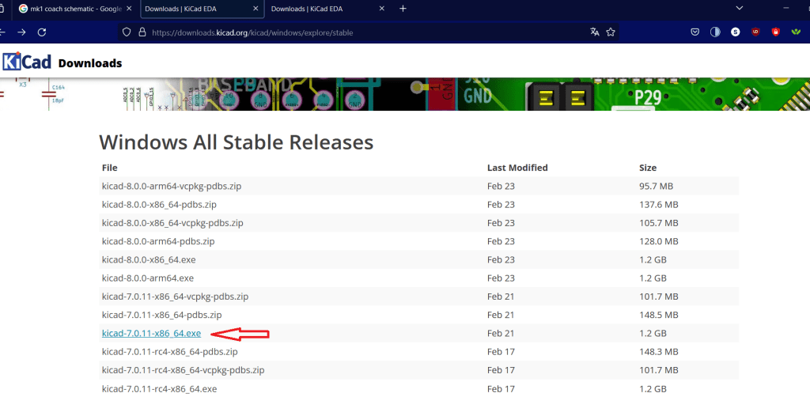{#Image3 align="bottom" width="684" height="335" border="0"}

# []{#stap-2-begin-een-nieuw-project}Step 2, start a new project {#stap-2-begin-een-nieuw-project .western}

------------------------------------------------------------------------

When you open KiCad, the first thing you should do is create a new project. Click File -> New Project and pick a good location in the file browser.

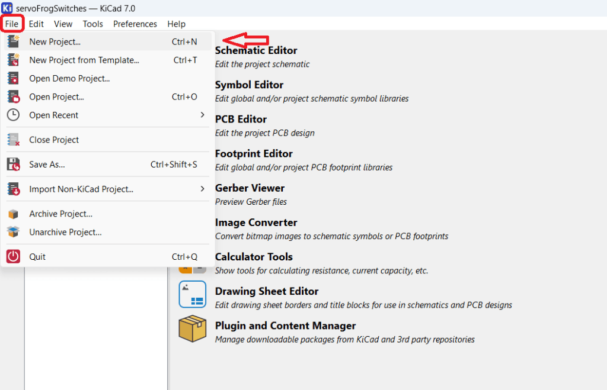{#Image4 align="bottom" width="687" height="442" border="0"}

KiCad creates a schematic and a board file for you. We usually start with the schematic, so click the “Schematic Editor” to open it.

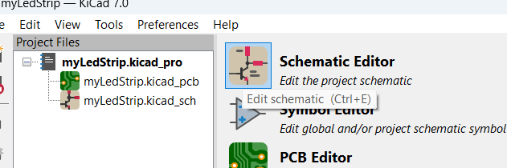{#Image5 align="bottom" width="680" height="226" border="0"}

# []{#stap-3-schema-maken}Step 3, create the schematic {#stap-3-schema-maken .western}

------------------------------------------------------------------------

Here we’ll first create the schematic for an LED strip. This is what Eeschema (the name of KiCad’s schematic editor) looks like. You might see different colors; you can customize all of KiCad’s colors, and I personally prefer dark backgrounds.

**Note.** You can also download the finished schematic from the [Train‑Science DIY GitHub](https://github.com/bask185/Train-Science-DIY/tree/master/PCB/analog_solutions/ledStrips/ledStrip_22cm).

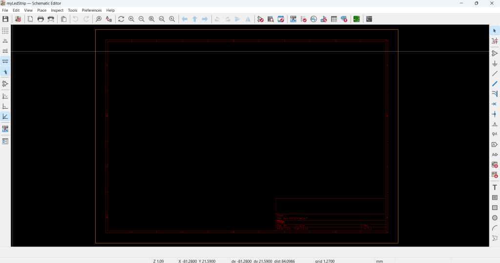{#Image6 align="bottom" width="671" height="354" border="0"}

A good LED strip for a model train should have the following components:

-   Rectifier

-   Buffer capacitor connection

-   Resistors

-   LEDs

-   Current source (optional)

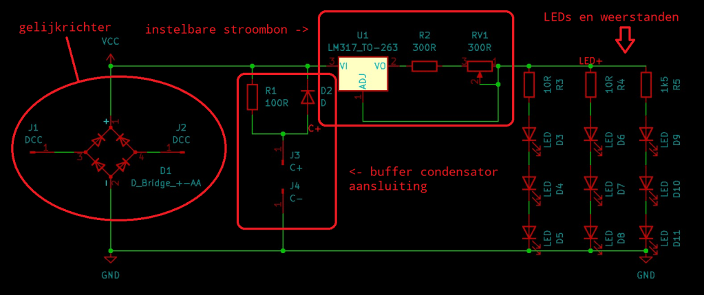{#Image7 align="bottom" width="669" height="280" border="0"} The complete schematic of the LED strip we’re going to build

To add a component, press the ‘A’ key on your keyboard. The first time it may take a moment because KiCad needs to load some things. We’ll start by placing a resistor. In the search bar you can simply type ‘R’; you should now see the resistor symbol. Click it and click OK.

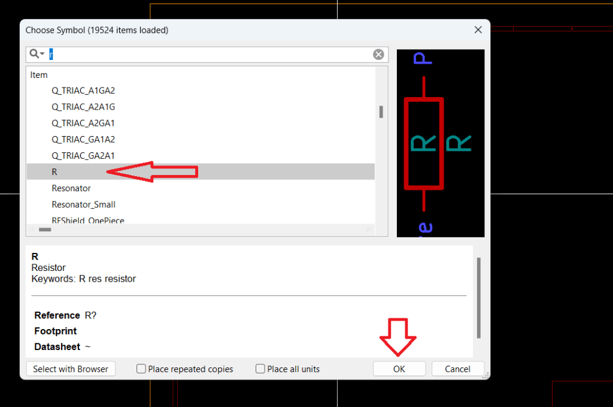{#Image8 align="bottom" width="670" height="445" border="0"}

The resistor is now attached to your mouse cursor. Choose a nice spot somewhere in the middle of the sheet and left‑click. We can still move the resistor later.

**Note.** You can rotate the resistor with the ‘R’ key.

*Extra explanation*

Each component comes with a “reference field” (R?) and a “value field.” For resistors it’s customary to enter the resistance value. If you double‑click the R you can add a value. But we’ll do this later because we don’t yet know what value it should be. You also don’t need to worry about the R?. In a schematic, every component gets a prefix (R for resistor, D for diode, U for IC, etc.) and a number. KiCad can fill in this number for us automatically.

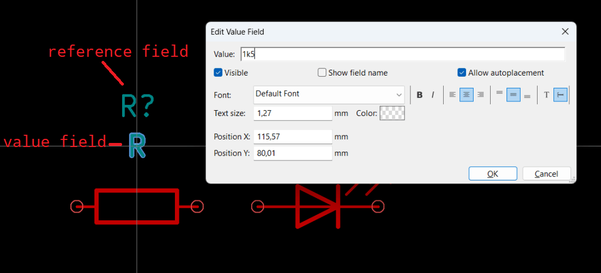{#Image9 align="bottom" width="668" height="304" border="0"}

Now add a few diodes as well. Three in series is a nice number. Press ‘A’ again and search for ‘LED’. If you don’t see it right away, scroll down a bit. You’ll find it in the “Device” library—you can’t miss it.

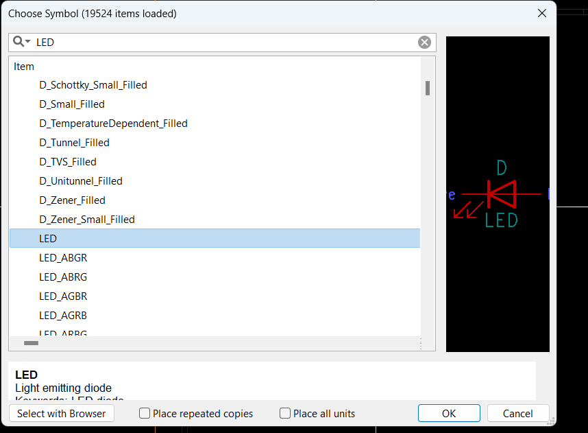{#Image10 align="bottom" width="641" height="472" border="0"}

Once you’ve placed the LED like you did the resistor, you can select it with your mouse and copy and paste it with Ctrl‑C and Ctrl‑V. Put the resistor and the three LEDs in series with the LEDs pointing in the same direction. You can connect the components with a *wire*. Start a wire by clicking on a connection dot (pin) of a component. The line follows your mouse; click another dot to make a connection.

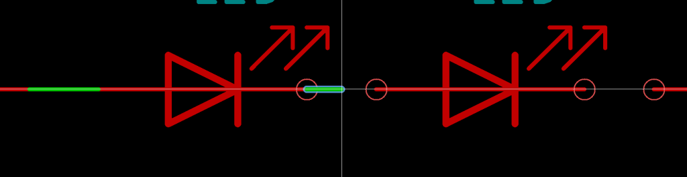{#Image11 align="bottom" width="660" height="171" border="0"}

When you’re done, drag a selection box over the resistor and LEDs to select them all. Rotate them with ‘R’ and copy (Ctrl‑C) and paste (Ctrl‑V) to get another group.

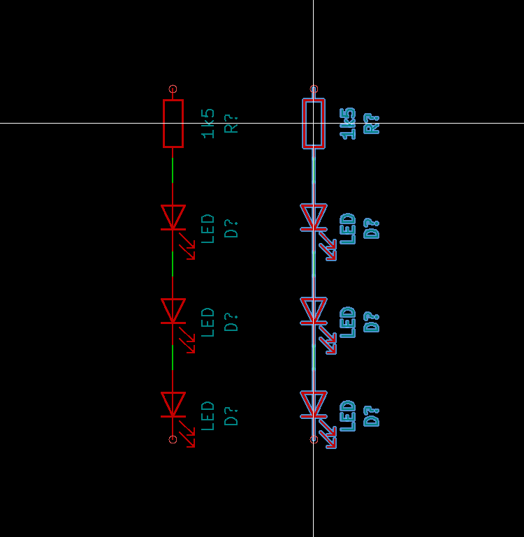{#Image12 align="bottom" width="676" height="693" border="0"}

An LED strip can’t do without a rectifier. Press ‘A’ again and search for D_bridge. Note that there are several with slightly different notations. That has to do with the various types of bridge rectifiers and their pinouts. The most common one—and the one we’ll use here—has + on pin 1, – on pin 2, and the AC connections ~ and ~ on pins 3 and 4. So we need D-bridge_+-AA.

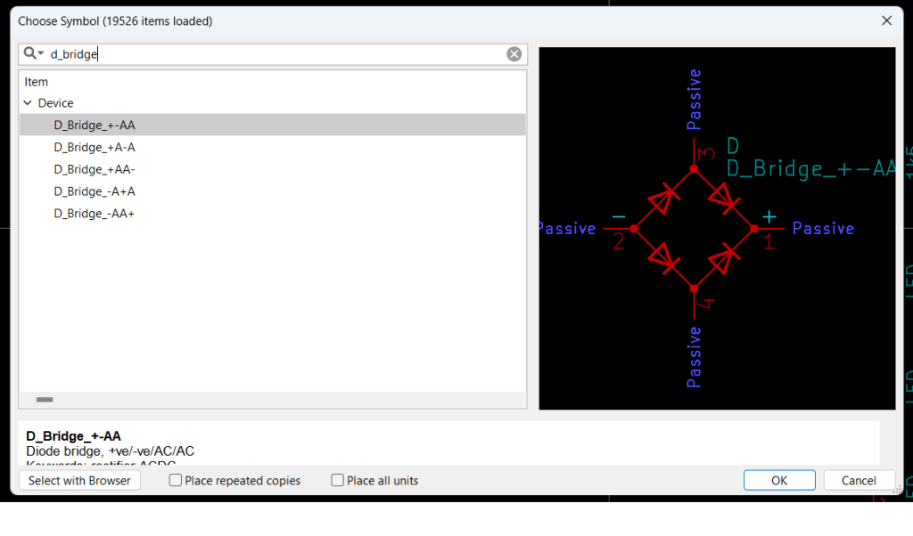{#Image13 align="bottom" width="664" height="390" border="0"}

**Note.** You can clearly see the pin numbering here. Feel free to look around at the other bridge rectifiers to see the differences.

Place the rectifier somewhere to the left of the LEDs and resistors. You may need to rotate it; make sure the – pin ends up at the bottom. To be able to solder wires to the board we need solder pads. As far as I know there is no standard symbol for that, so we’ll use a “generic connector” with only one pin (tip: search for “conn_01x01_pin”).

Place two of these connectors next to the rectifier and connect them with wires to the AC pins of the rectifier as shown in the picture. After placing the pins, you can optionally rename them to something else, for example “DCC.” This has no practical effect other than improving the readability of the schematic.

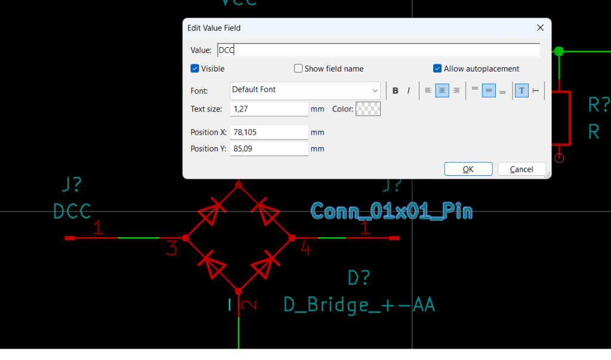{#Image14 align="bottom" width="657" height="388" border="0"}

It’s also common to add *labels* to *wires*. This also improves readability. You can also use labels to connect two points without drawing a wire between them.

To add a label, press ‘L’ on your keyboard. A small window opens where you enter a name. After clicking OK, place the label with your mouse.

Besides “normal” labels, KiCad also has *Power labels*. These look slightly different. The – leg of the rectifier will be tied to ground, a.k.a. GND. Press ‘P’ on your keyboard to add a power label and search for GND. Place the GND somewhere below the rectifier and connect the bottom pin to the GND label.

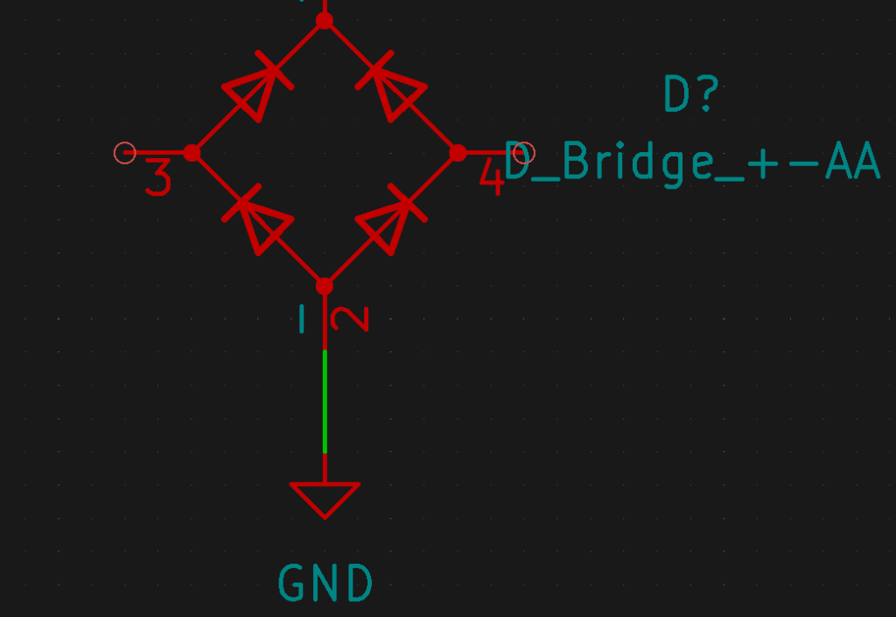{#Image15 align="bottom" width="677" height="467" border="0"}

Do the same with the VCC (Common Collector Voltage, or simply “the positive power connection”) power label at the top.

It should look roughly like this:

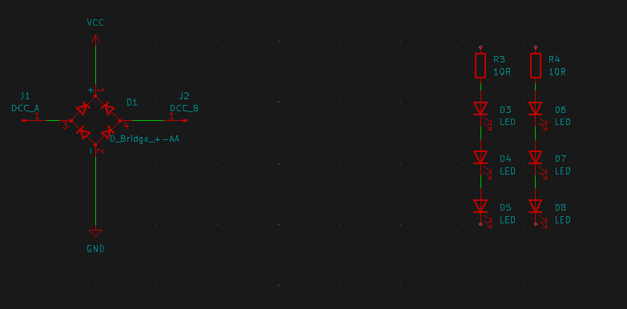{#Image16 align="bottom" width="635" height="313" border="0"}

The next thing we’ll add is the buffer capacitor. For a modest strip, an electrolytic of 470 µF @ 25 V is more than sufficient. You’ll probably get away with 220 µF as well. You can choose to solder the electrolytic directly to the LED strip or to provide solder pads for it. For my specific coach I want a through‑hole capacitor at the end of the strip.

Therefore I also want to add two solder pads for the capacitor. In addition you need a resistor of ~100 Ω and a diode for charging and discharging. You can copy and paste the resistor and solder pads from your earlier work. You still need to add a diode: press ‘A’ and search for ‘D’. You should be able to find it.

Wire everything as shown in this image.

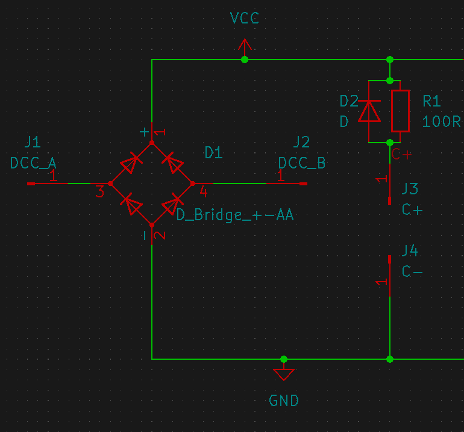{#Image17 align="bottom" width="666" height="621" border="0"}

**Note.** I changed the “values” of the solder pads to C+ and C– to make a clear distinction.

*Extra explanation of the circuit:* The resistor is needed to slowly charge the capacitor. If we don’t do this and you have too many of these LED strips on your DCC circuit, your command station and boosters may not be able to supply the inrush currents to charge all your capacitors. The diode ensures that the capacitor can discharge quickly when the coach briefly loses power on a dirty section of track.

The next thing we’ll add isn’t 100% necessary, but it’s recommended: a current source. A current source’s job is to deliver a constant output current while the input voltage varies. During capacitor discharge the voltage drops; without a current source you’ll see your LEDs slowly dim. The current source keeps the output current constant during discharge for as long as the capacitor voltage is high enough. That way the LEDs keep a constant brightness throughout the run.

This video shows it:

[video](https://youtu.be/rWNDIeCRfUM)

The current‑source circuit consists of an LM317 IC and a resistor. When you add the LM317 you’ll see many variants. Choose the one with TO‑252 in the name; this is an SMD package of a suitable size. For the resistor I found by trial and error that 470 Ω gives me a nice brightness. You could also choose, for example, a 300 Ω resistor together with an adjustable 300 Ω trimmer so you can set the brightness afterwards yourself. The trimmer must then be placed in series with the resistor.

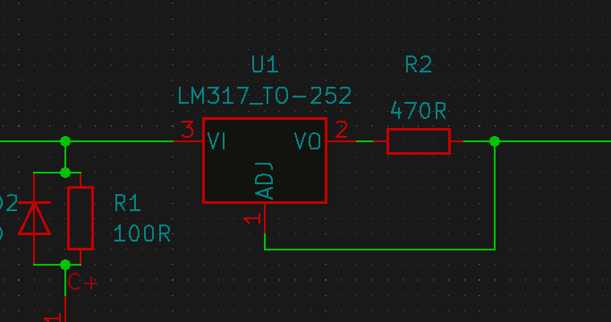{#Image18 align="bottom" width="675" height="356" border="0"}
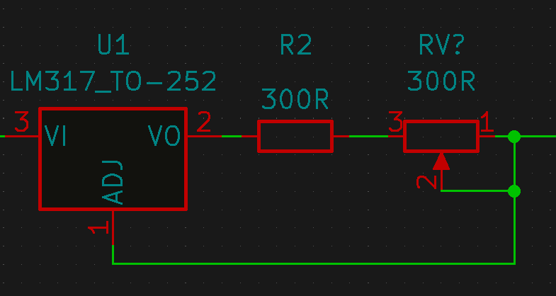{#Image19 align="bottom" width="679" height="361" border="0"}

The last thing to do in the schematic is draw the final lines. I connected the current source output to the LEDs with their resistors. I also added a label named led+. The advantage of a label is that we can see this name in the board layout as well.

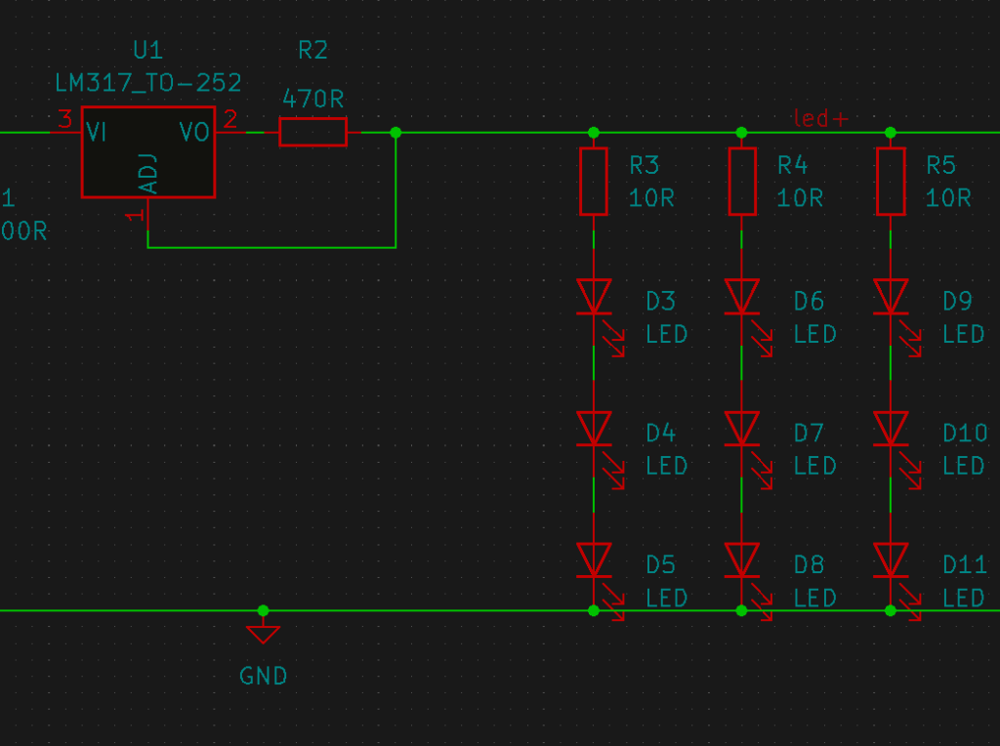{#Image20 align="bottom" width="681" height="508" border="0"}

**Note.** If you need more or fewer LEDs, you can easily select one such group and copy and paste it, or delete it with the DELETE key. For my coach I used a total of 18 LEDs. The complete schematic looks like this:

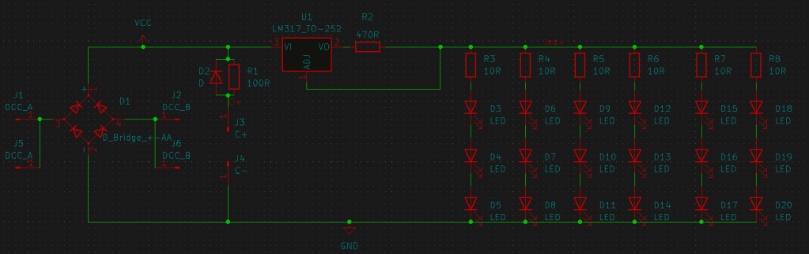{#Image21 align="bottom" width="680" height="215" border="0"}

**Note.** I added two extra solder pads near the rectifier. I want solder pads at both ends of the coach so I can pass the DCC voltage through.

The schematic is now complete and you can proceed to the next step.

# []{#stap-4-footprints-zoeken-en-toewijzen} Step 4, find and assign footprints. {#stap-4-footprints-zoeken-en-toewijzen. .western}

------------------------------------------------------------------------

Before we can make a board, we need to choose the footprints—the physical sizes of the parts we’re going to use. First click the button above the red arrow; this opens the “Footprint Assignment Tool.”

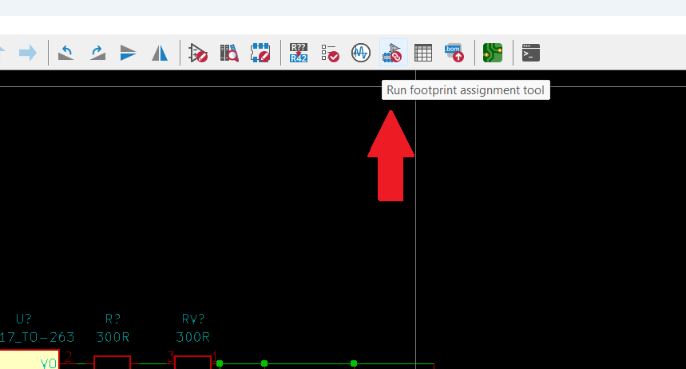{#Image22 align="bottom" width="661" height="356" border="0"}

You’ll first get a notice that your schematic hasn’t been annotated yet. That means your components don’t have numbers assigned yet—all those question marks ?. If you click *Annotate*, KiCad will choose the numbers for you. Sometimes you’ll want to do that manually; for this schematic it doesn’t really matter. The numbers are arbitrary.

This is the Footprint Assignment Tool.

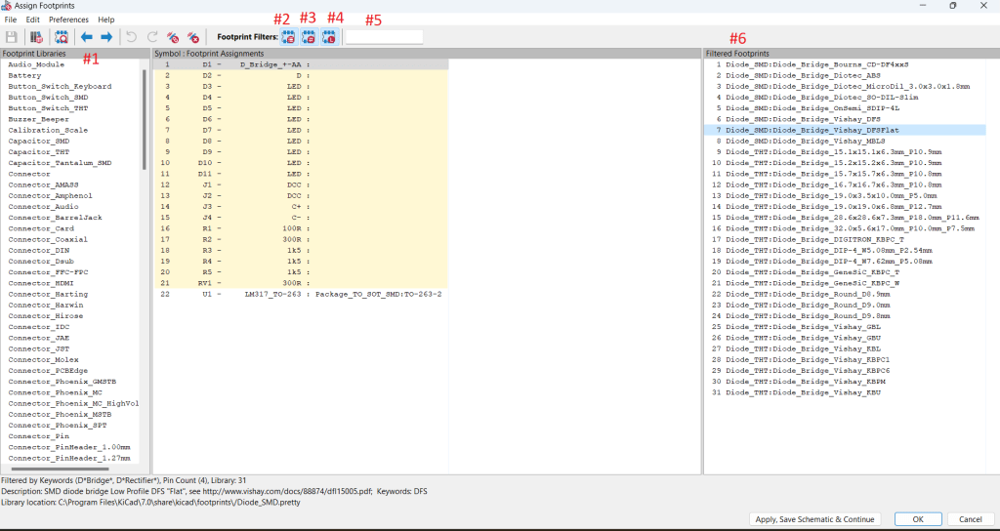{#Image23 align="bottom" width="677" height="360" border="0"}

First I’ll explain what the numbered buttons are. 1) are the libraries; sometimes when you search manually you can select a library there. 2) through 4) are the search filters. 2) filters on the properties that symbols have. Each symbol has attributes that help automatically put the right libraries in front of you. 3) indicates whether the number of pins must match. If, for example, you’re looking for a 1‑pin connector, you don’t want to see all 20‑pin connectors. Sometimes you’ll want to turn this off if your footprint has extra mounting pads. 4) filters by library. Usually you want 2 through 4 turned on. In 5) you can enter an extra search term. In 6) you’ll see the filtered results to choose from.

**TIP:** For DIY PCBs like this it’s wise to buy your components first before doing this step. That can prevent nasty surprises later.

In the assignment tool you can see that only the LM317 already has a footprint. We still need to choose the rest. Knowing your components is a *craft* in its own right. So I’ll tell you what’s easy for our strip.

We want to use as many 1206 resistors, LEDs, and diodes as possible. These are relatively large and fairly easy to solder. If you type 1206 in the search bar under number 5) and then click a resistor or LED in the middle, all the filters ensure you have only a few results left—which is nice of course.  
Double‑click everything that says 1206 and **hand solder.**

*TIP:* To work faster, you can click a resistor that already has a footprint set and copy it. Then select all the other resistors and paste the footprint.

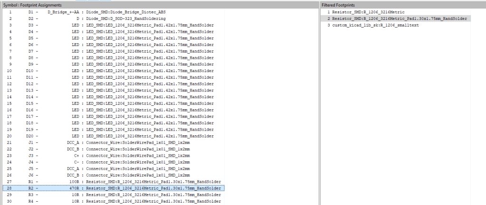{#Image24 align="bottom" width="677" height="286" border="0"}

**Note.** The “hand solder” footprints are slightly larger than the others. Since we’re going to solder by hand we obviously choose the hand‑solder version. Do this for all LEDs and resistors.

**Note.** You’re not obliged to use SMD parts. You can also choose, for LEDs, diffuse 3 mm through‑hole LEDs. KiCad has footprints for those as well. Same for resistors.

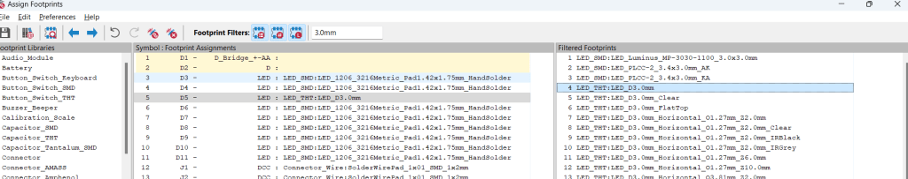{#Image25 align="bottom" width="697" height="138" border="0"}

The trickiest footprint is the bridge rectifier. The most suitable is “Diode_Bridge_Diotec_ABS.” You can find it in the “Diode_SMD” library. If you select that library in the left column, on the right you should only have SMD bridge rectifiers left. For the single diode we have, you can choose SOD‑323 hand solder.

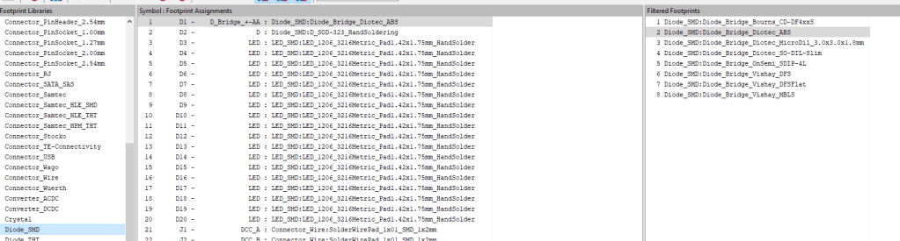{#Image26 align="bottom" width="687" height="184" border="0"}

As for the six solder pads: if you search for “solder” you’ll find two footprints, one of which is 1×2 mm. That’s a nice large size for a solder pad.

If you opted for a trimmer: there are really a lot of them. You can pick a small one like VG06, but you can also choose a somewhat larger one. I recommend first seeing what you can find on Aliexpress and then picking the matching footprint.

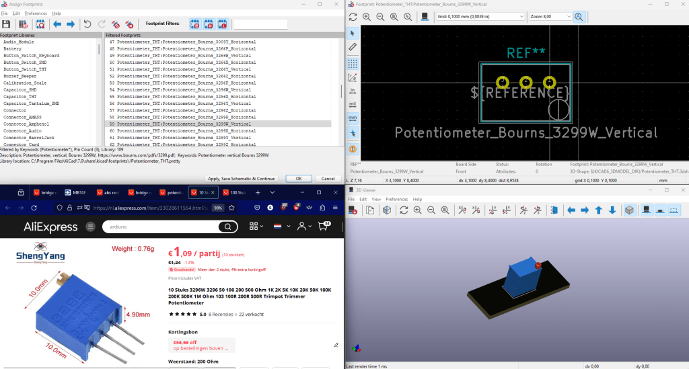{#Image27 align="bottom" width="676" height="362" border="0"}

The very last and most important step is not to forget to click OK. If you accidentally press Escape or Cancel, you’ll have to assign your footprints again.

# []{#stap-5-board-ontwerp-maken}Step 5, create the board layout {#stap-5-board-ontwerp-maken .western}

------------------------------------------------------------------------

We can finally get to the real work: making our custom LED strip. Click the green button indicated by the arrow. This opens “pcbnew,” KiCad’s board editor.

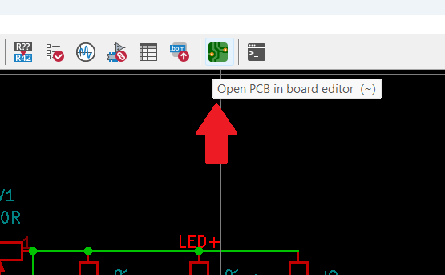{#Image28 align="bottom" width="633" height="391" border="0"}

You’re now looking at an empty board. To bring in all our components, click the “Update PCB” button. Shortcut is F8. This opens a new window; click Update PCB there. The default settings should be fine.

If everything went well, you should see something like this. All your components are neatly lined up for you to place wherever you like. You can click a component and drag it with your mouse. The hotkey is M.

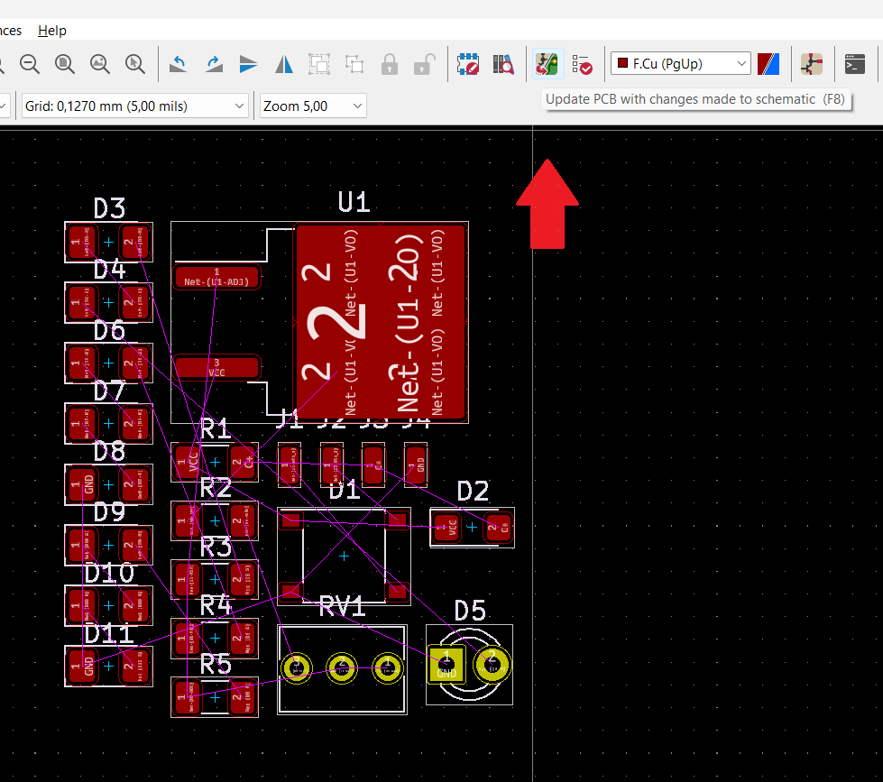{#Image29 align="bottom" width="677" height="599" border="0"}

Placing components is the most critical—and perhaps most difficult—part of any PCB. Fortunately for us, we’re making a simple LED strip.

**Note.** You can flip any component (hotkey F) to the bottom of the board. In KiCad we always look at the board from the top. If you’ll also view your coach from above and place the components on the bottom layer, you won’t fall into a mirror‑image confusion trap.

*Tip:* KiCad has a built‑in 3D viewer. You can open it from the board editor with Alt+3. Take an occasional look at the 3D view to check that everything is going well.

To make routing (drawing the traces) as easy as possible, it helps to keep the groups of components together. For example, if you go back to the schematic and select one such group of LEDs and resistors, they’ll be selected automatically in the board. Then you can move the whole group at once with M.

You can load a picture into both the schematic and the board in KiCad. If you have a good 2D drawing of your coach interior where you can clearly see the compartments—and thus the locations of the LEDs—you can load a drawing with this button.

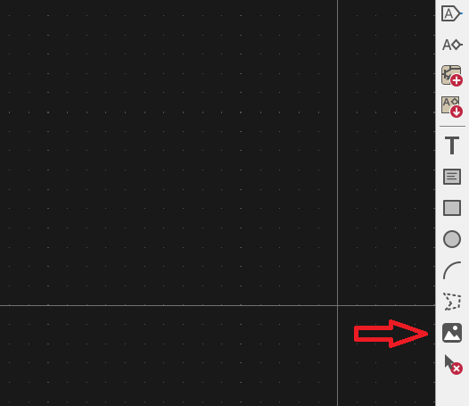{#Image30 align="bottom" width="597" height="517" border="0"}

The drawing won’t be to scale, but you can easily rescale it. For that you need at least one reference dimension. If, for example, the drawing shows that the centers of the compartments are 2 meters apart, you can place a *measurement* in KiCad.

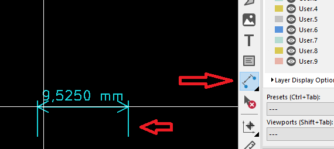{#Image31 align="bottom" width="613" height="274" border="0"}

With at least one good measurement, you can scale your image correctly to 1:87 (or whatever scale you’re working in).

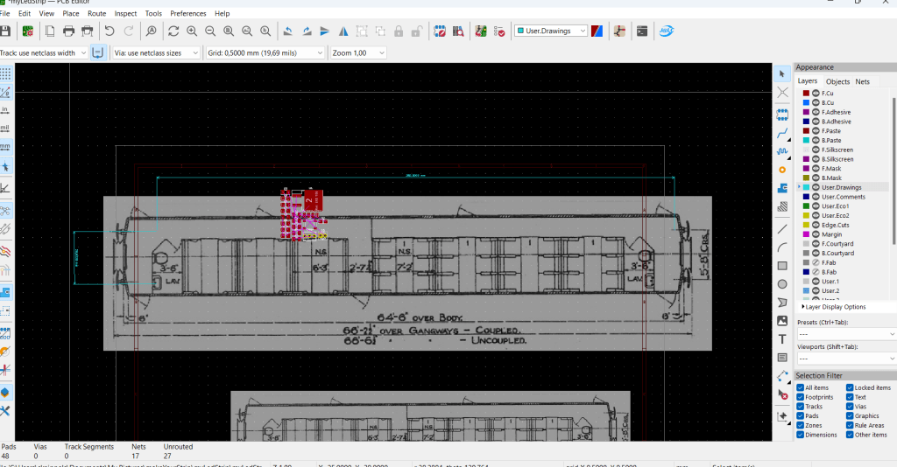{#Image32 align="bottom" width="677" height="353" border="0"}

With a correctly scaled image, you can drag your LEDs to their final positions. Try to arrange things so the LEDs of the groups end up behind one another. You can easily see this from the connection lines (purple for me).

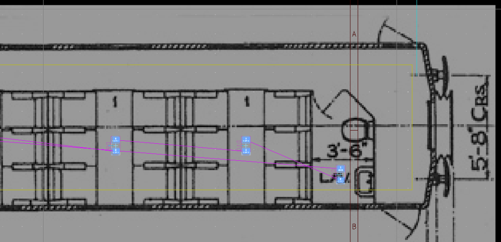{#Image33 align="bottom" width="674" height="326" border="0"}

Besides images you can also simply use KiCad’s graphical tools. You can draw lines, rectangles, arcs, and all sorts of things. Before you do this, I recommend changing the grid size to 0.5 mm. This makes it easier to place dimensions and elements in millimeters. You can of course choose a finer grid size of 0.25 or 0.1 mm.

Before you place lines, dimensions, and rectangles, first select the user drawings layers in the right‑hand column. Your lines will then end up on a particular layer that only we can see. Elements on a user drawing layer have no effect on the final PCB layout.

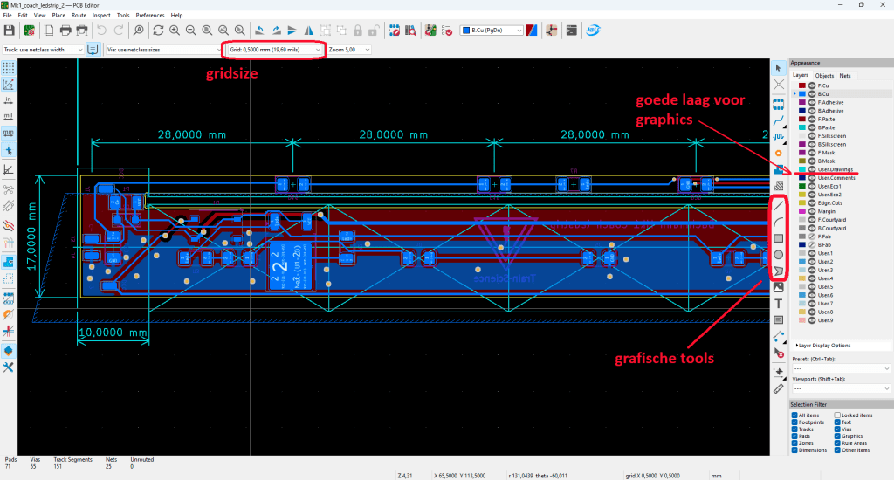{#Image34 align="bottom" width="683" height="367" border="0"}

Every PCB in KiCad must have *Edge.Cuts*. These are the board outline contours. In the case of this Mk1 coach, my edge cuts look like this:

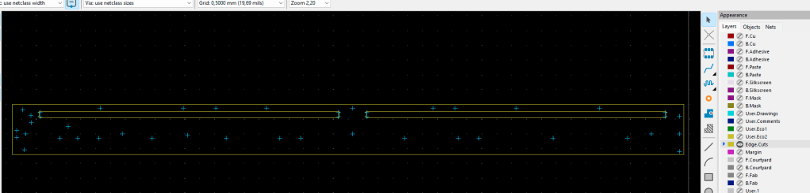{#Image35 align="bottom" width="681" height="163" border="0"}

*Tip:* Using the “eye” symbols you can toggle the various layers on and off. In the image above I’ve turned everything off except the Edge.Cuts layer. That can sometimes make it easier to see what you’re doing.

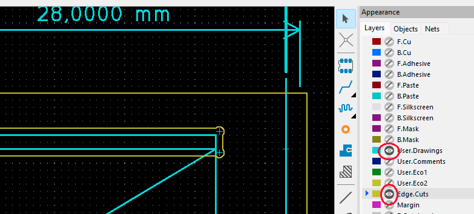{#Image36 align="bottom" width="675" height="305" border="0"}

Once you’ve made your edge cuts and your PCB has its final shape, it’s a matter of dragging your components to good spots where they fit. Start with the LEDs—they’re the most important—and then do the rest. Place the solder pads at the ends where you want to solder the wires later. And think about where you want to solder your capacitor.

During this process you’ll do yourself a favor if the connection lines a.k.a. *airwires* remain as tidy and short as possible. This makes it easier to draw the actual traces later.

The airwires clearly visible:

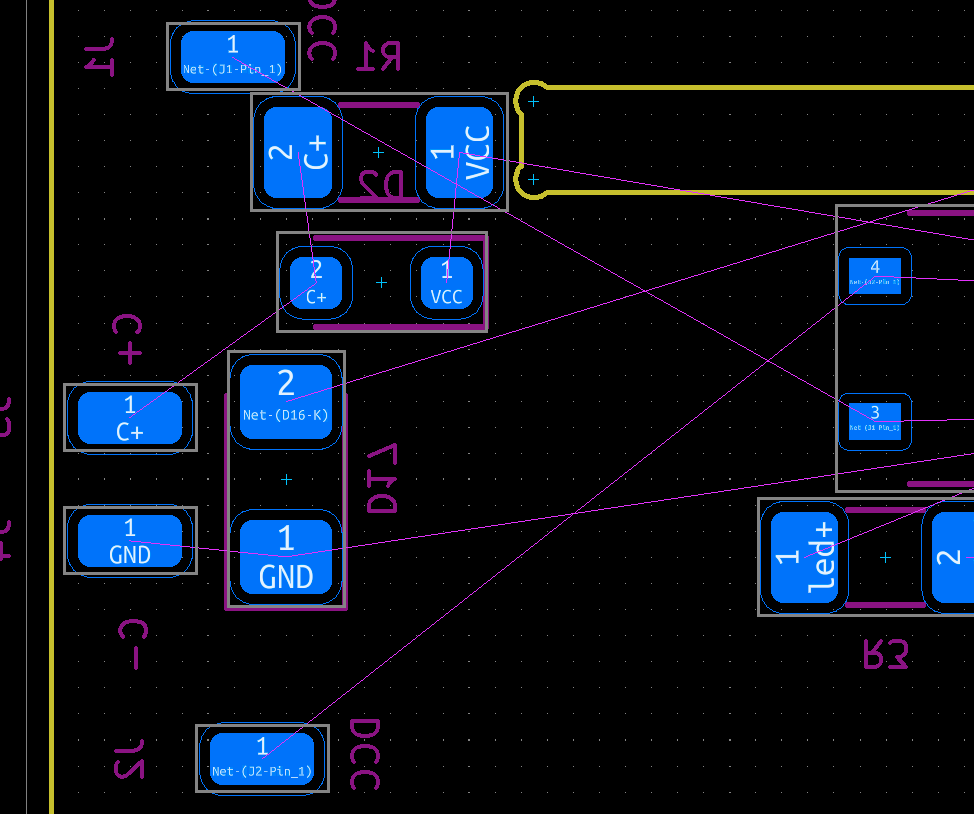{#Image37 align="bottom" width="664" height="596" border="0"}

When you think all components have a good place, open the 3D viewer again and give your coach another look.

You now have to route all the traces. Before we do that, I only want to tell you **not** to route the GND pins—we have other plans for those. If you want (not required), you can click “Nets” in the right column and then hide the airwires for GND.

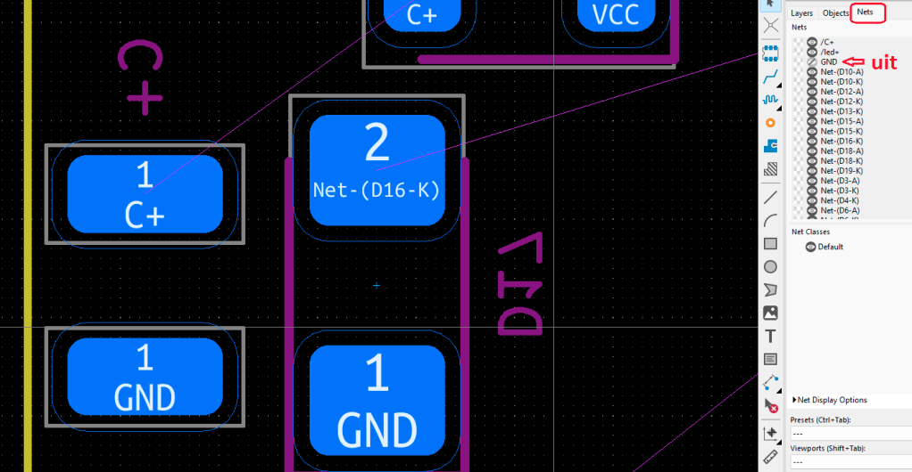{#Image38 align="bottom" width="672" height="348" border="0"}

If you now click a pad of a component, you can draw a trace. There’s also a hotkey for it (X).

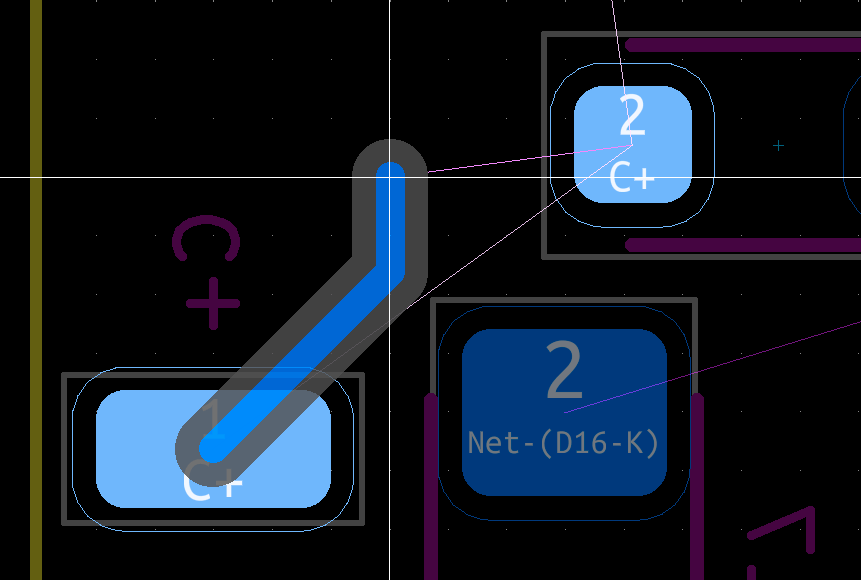{#Image39 align="bottom" width="674" height="454" border="0"}

Sometimes you unfortunately need to cross. Try to avoid it where possible; try to run a track under a footprint instead. When you really can’t avoid it, you need to go to the other side of the board using vias. Press the hotkey V to hang a via under your mouse; place it with a click.

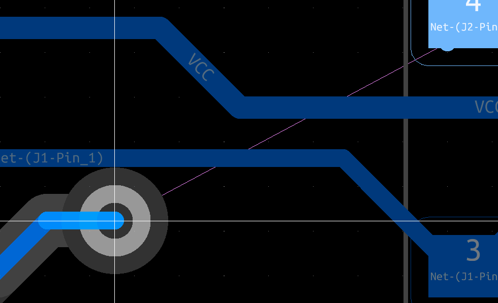{#Image40 align="bottom" width="684" height="417" border="0"}

After placing a via, KiCad’s router continues on the other side of the PCB, the top copper layer. By pressing V again you can jump back to the other layer.

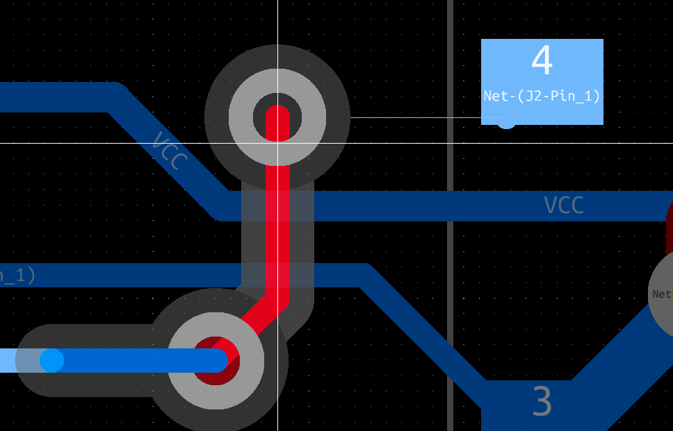{#Image41 align="bottom" width="680" height="436" border="0"}

It can happen that during routing you discover that your component placement isn’t quite working out. Of course you can always change it. And sometimes you need to start over with routing. My very first board also took five attempts before I was satisfied.

To remove all tracks and vias, click “Edit” -> “Global deletions” at the top of the screen. A menu opens where you can choose what to remove. If you want to re‑route, check tracks and vias and click OK. This removes all placed vias and tracks.

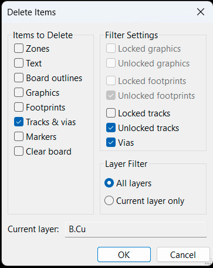{#Image42 align="bottom" width="388" height="456" border="0"}

If you’ve placed all tracks, we’re almost done. The last thing we still need is a ground plane. This fills all free areas of the PCB with a large zone. We’ll tie this zone to ground so that all pins with GND are connected to this zone.

First select either the top or bottom copper layer. Then click the “Add filled zone” button. Click somewhere outside the board to start the copper pour. This opens a new window.

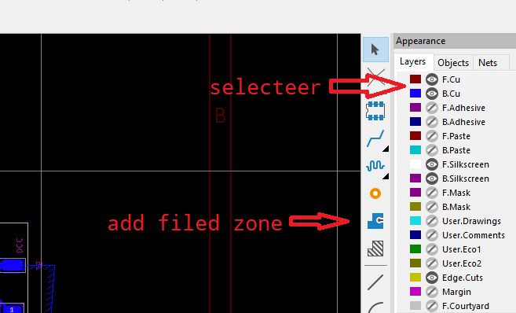{#Image43 align="bottom" width="657" height="398" border="0"}

For SMD boards it’s usually convenient to have a ground plane on both the TOP and BOTTOM. Check both boxes on the left and select the GND net under NET. Use the filter if you can’t find it. Click OK when you’re done.

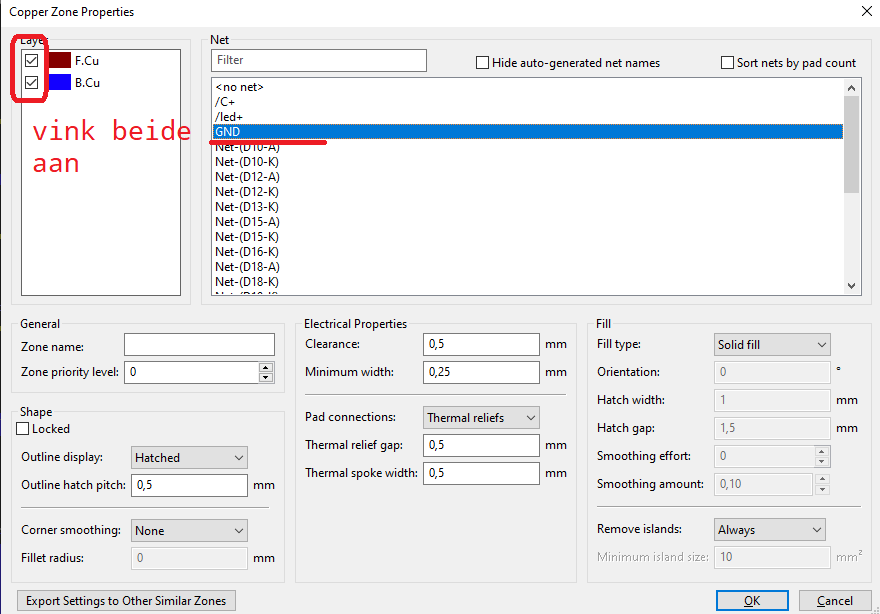{#Image44 align="bottom" width="679" height="474" border="0"}

You’ll now see a line sticking to your mouse—you’re placing a zone. Draw a rectangle around your PCB. The exact size and shape aren’t important.

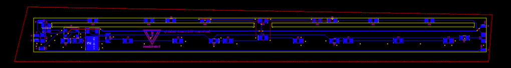{#Image45 align="bottom" width="696" height="93" border="0"}

If you now press ‘B’, the zone will be filled with copper. You can toggle the copper zone with these buttons on the left of the screen. You’ll also see that the GND pins are automatically connected to the ground zones.

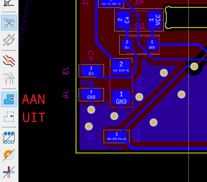{#Image46 align="bottom" width="517" height="454" border="0"}

You now have two ground zones on the top and bottom of the board. If you only have SMD pads, the zones are not connected to each other, and all the traces can prevent some GND pads from being connected. You now need to manually drop extra vias to stitch the GND planes together. At each GND pad you should place a via yourself. You can also place vias at interruptions and spurs. Click the via button by the arrow or press V to place vias; then it’s just a matter of clicking on your board.

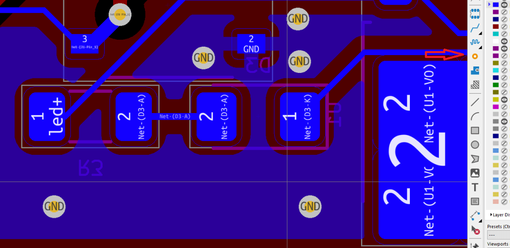{#Image47 align="bottom" width="677" height="331" border="0"}

In principle your board is ready. But you should always run the Design Rule Checker to see whether you’ve made mistakes. You can review warnings, but they’re not very important; errors are important.

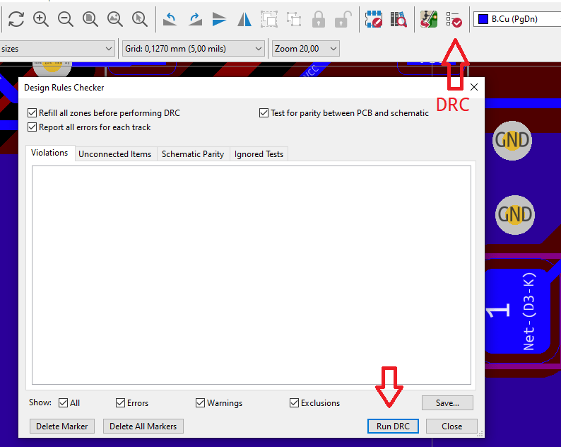{#Image48 align="bottom" width="651" height="518" border="0"}

If you have no errors, you can safely have your board manufactured. The default settings in KiCad are sufficient for JLCPCB.

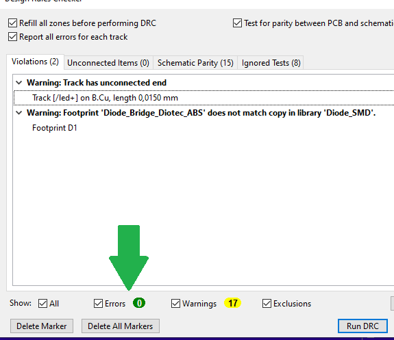{#Image49 align="bottom" width="575" height="497" border="0"}

The very last thing you might still want to do is add extra silkscreen text. These are texts that will also appear on your PCB. For LEDs and diodes you can mark a + or – (the standard KiCad footprints aren’t very clear about + and –). Also where you’ll connect your capacitor you’ll want a + and –.

To place text, first select your desired layer—here, the B.Silk layer. Then click the big T to place text. You can optionally adjust the size and rotation. You can place silkscreen on both bottom and top layers.

**Note.** Because you’re working on the bottom layer, you’ll see everything mirrored.

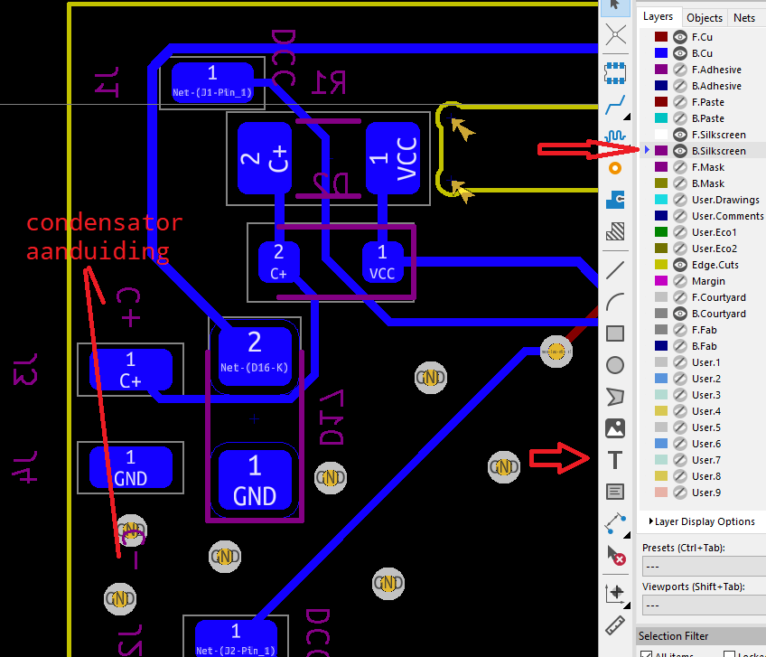{#Image50 align="bottom" width="657" height="564" border="0"}

If your silkscreen looks good, check the 3D viewer once more to see if it still looks good there. If your PCB passes your visual inspection, you can move on to the next step.

## []{#stap-5a-footprint-aanpassen}Step 5a, adjust a footprint.

While soldering I had a small—not big—issue soldering the large pad of the TO‑252 (our current source). This was mainly because the component covered the entire large pad. Also, this large pad can cause problems if your soldering iron doesn’t have enough power. That’s why I’ll show here how you can adjust the footprint.

First select the component (click somewhere on its outline) and press ‘E’. This opens the “Footprint Properties” window. Then click “Edit footprint,” which opens the footprint editor.

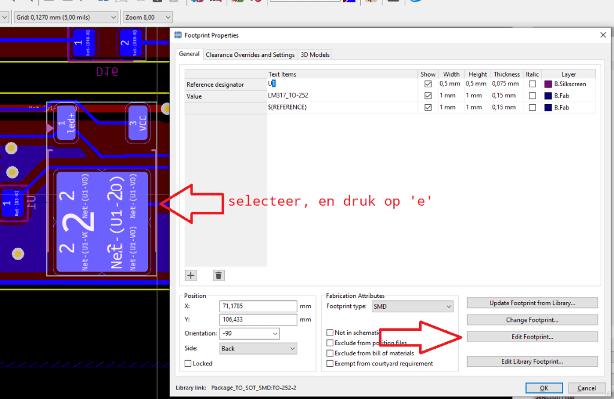{#Image51 align="bottom" width="687" height="447" border="0"}

The footprint editor isn’t very different from the PCB editor. What we want to do here is move the large pad 2 slightly to the right by about 1 mm, and it can be considerably smaller. We’re not going to push large currents through this current source anyway.

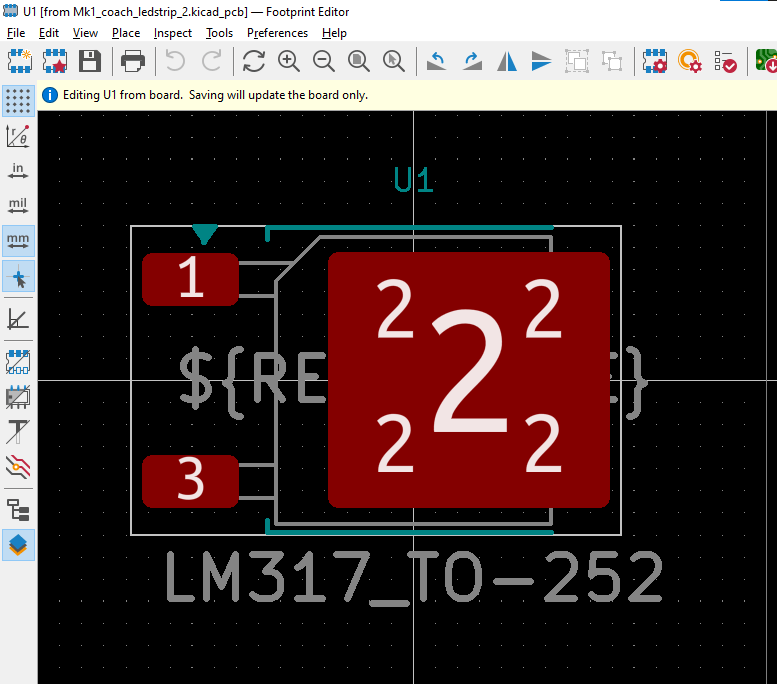{#Image52 width="632" height="556" border="0"}

This large pad consists of multiple pads. They’re all numbered 2. This corresponds to the pin numbers of the symbol in the schematic and is related to SMD assembly. The small pads ensure that not too much solder paste ends up on the pad. You can see this if you drag the larger pad away.

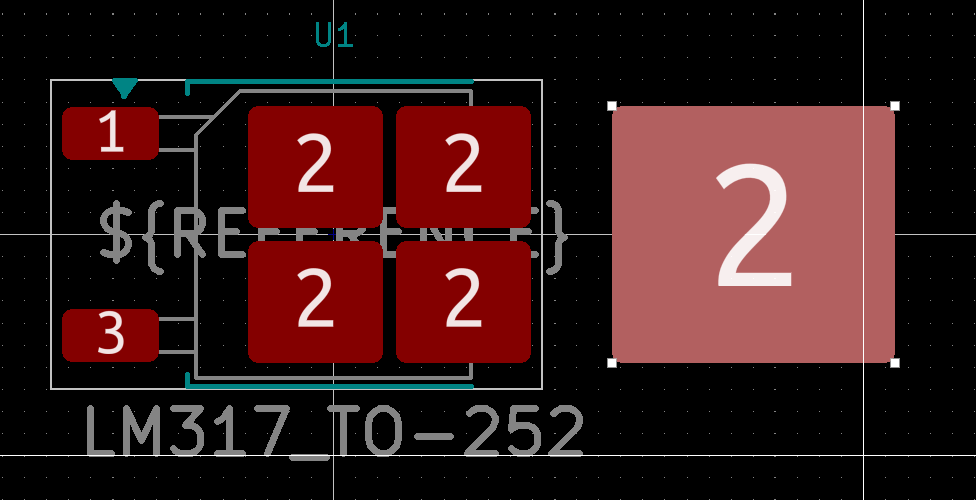{#Image53 align="bottom" width="641" height="329" border="0"}

Click here for a more [detailed explanation on the KiCad forum](https://forum.kicad.info/t/why-so-many-pads-in-this-footprint/50879) if you’re interested.

I’m going to remove the small pads by clicking them and pressing the Delete key.

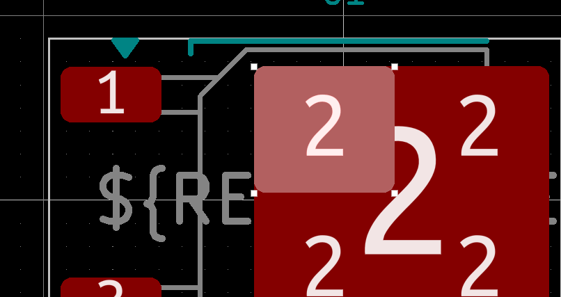{#Image54 align="bottom" width="543" height="427" border="0"}

Then I’ll move the large pad 1 mm to the right. For that I need to set the grid size to 1 mm or 0.5 mm.

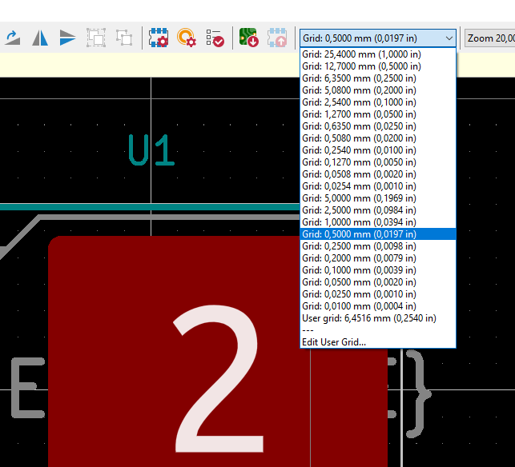{#Image55 align="bottom" width="648" height="584" border="0"}

Then you can simply click the large pad to drag it to the right with your mouse. Each time you drag something, you’ll see it snap. That snap distance corresponds to your grid size. If you choose a grid size of 0.5 mm and you want to move something by 1 mm, you should see the pad snap twice while dragging to the right.

Here the pad has been moved by 1 mm. To make it smaller, click one of the small white squares at the corners on the left and drag to the right.

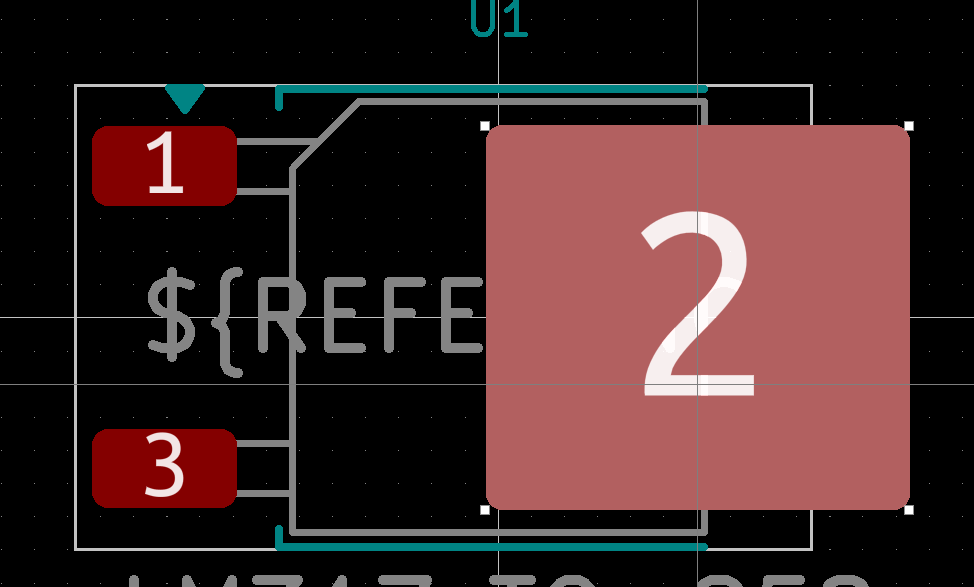{#Image56 align="bottom" width="666" height="402" border="0"}

You can safely halve this pad in size.

*Tip:* You can also use the 3D viewer in the footprint editor.

It should look roughly like this.

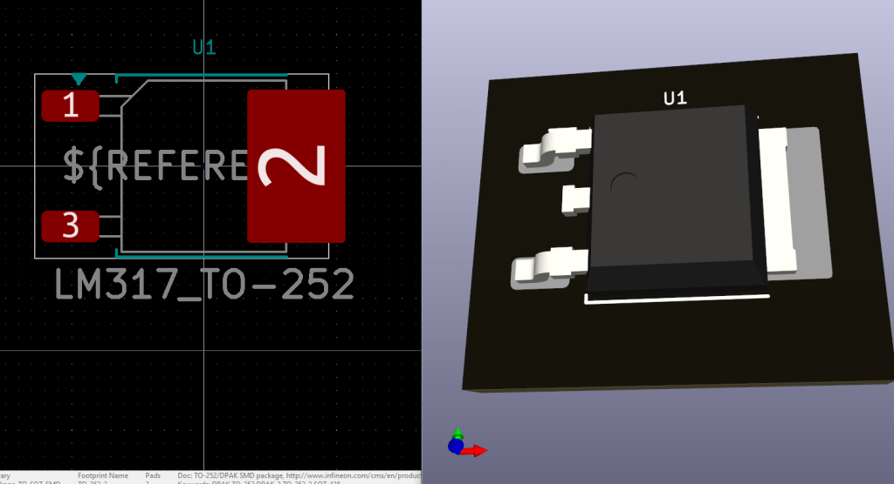{#Image57 align="bottom" width="661" height="359" border="0"}

There’s one more small thing you need to do: click pad 2 again and open its properties. There you need to check the F.Paste layer.

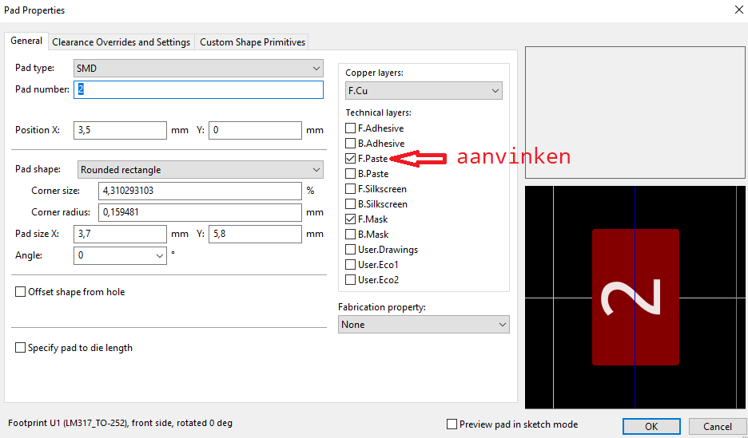{#Image58 align="bottom" width="680" height="399" border="0"}

When you’re done, save the modified footprint (Ctrl‑S). This only changes this footprint inside this board design.

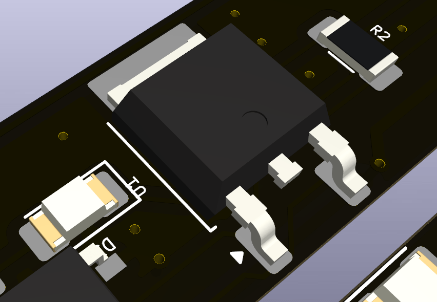{#Image59 align="bottom" width="668" height="462" border="0"}

# []{#stap-6-gerber-bestanden-plotten}Step 6, plot Gerber files. {#stap-6-gerber-bestanden-plotten. .western}

------------------------------------------------------------------------

Gerber files are the files PCB fabs need to manufacture your boards. In KiCad click the “Plot” button. A new window opens. Click the Plot button (the lower arrow) to generate the Gerbers.

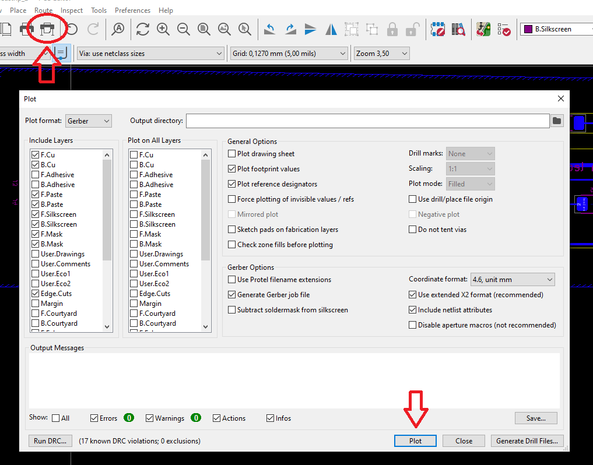{#Image60 align="bottom" width="679" height="533" border="0"}

Besides Gerbers we also need drill files. They contain all the holes. For some reason we need to do this separately. In the Plot menu click “Generate Drill Files.” This opens another new window. There you need to click “Generate Drill File.”

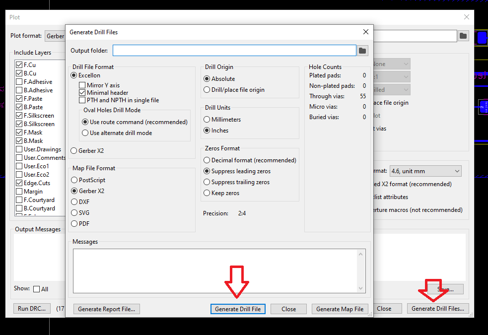{#Image61 align="bottom" width="667" height="458" border="0"}

You’ve now created all the files your PCB fab needs. The only thing left is to put all these files into a zip archive. The files are loose in your project folder. Close KiCad, open your file explorer and navigate to your project folder. There you can create a folder and give it a suitable name such as “GERBER‑coach_type_ledstrip.” Drag all files ending in .gbr and .drl into this folder. Then right‑click the folder and create a zip file from it.

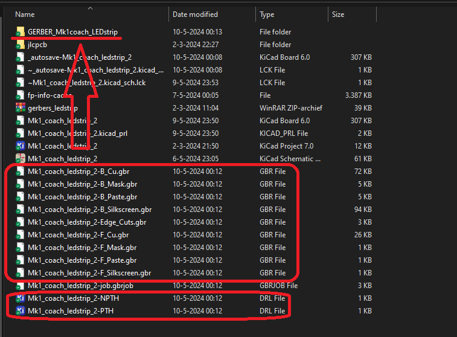{#Image62 align="bottom" width="670" height="494" border="0"}

# []{#stap-7-printen-bestellen-bij-de-printenboer} Step 7, order PCBs from the fab {#stap-7-printen-bestellen-bij-de-printenboer .western}

------------------------------------------------------------------------

I’ll refer you to [this page](https://github.com/Open-Source-Model-Railway-Electronics/docs/blob/master/Ordering_bare_PCB/Ordering_bare_PCB.md) for ordering. Don’t worry, it’s a very simple process. For LED strips in trains I recommend either the blue or black solder mask. Bright colors can catch reflections.

