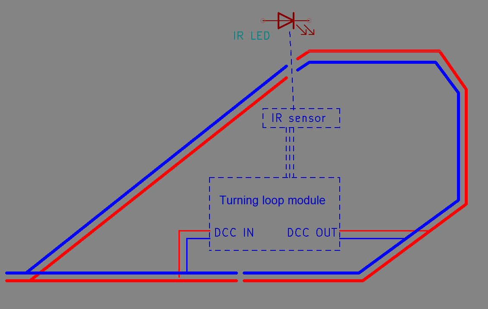
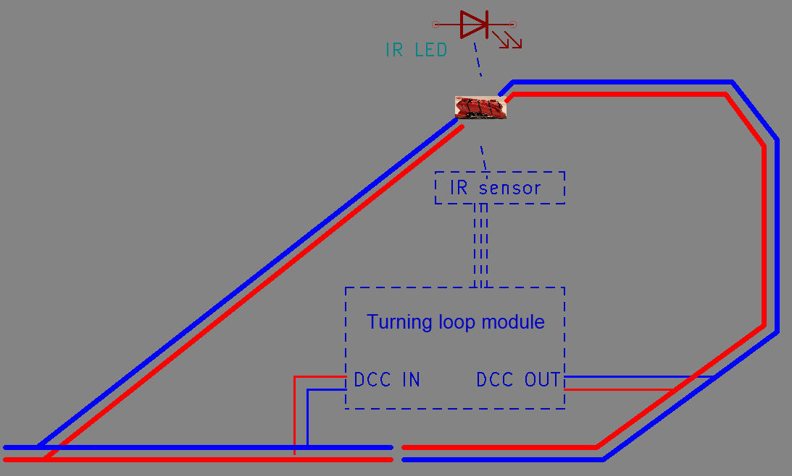
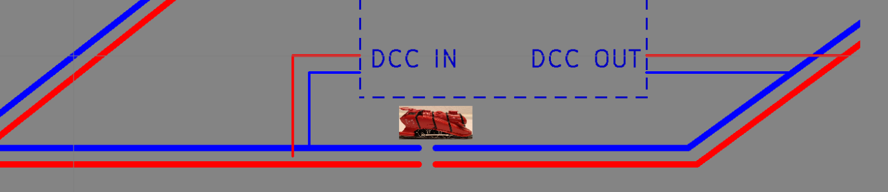

# Reverse Loop Modules

There are various reverse loop modules available for solving the well-known reverse loop problem.  
Personally, I find most of these modules extremely expensive, while the solution itself can be quite simple and inexpensive.

Before I go further: there is a huge difference between **analog** and **digital** layouts when it comes to solving the turning loop problem.  
In digital layouts, you switch the turning loop section; for analog layouts, you need to switch the rest of the tracks.  
The analog section can be found at the bottom of the original document.

---

## The Problem

The principle is quite straightforward.  
At the top section of the track, the blue and red rails come together.  
Normally, if you connect these rails directly, you create a short circuit — this is the infamous **reverse loop problem**.

  
*Figure 1: A reverse loop module in idle state*

---

## The Solution for Digital Layouts

This problem can be solved using a reverse loop module.  
There are many types available, but the **simplest, most robust, and cheapest** method is the **relay method combined with a light barrier**.

When a train passes through the light barrier, the isolated reverse loop section is immediately polarized to match the adjoining track using a relay.  
Because the reverse loop section now has the same polarity as the connected rail section, the train can pass smoothly without causing a short circuit — regardless of direction.

  
*Figure 2: The same module with a train in the loop*

Once the train has completely left the light barrier, the relay returns to its idle state.  
By the time the train reaches the lower section, the reverse loop section has again matched the polarity of the lower track.

As with any reverse loop module, it is essential that trains are **shorter than the isolated reverse loop section**.

The beauty of this system is that it is **self-operating** — you don’t need to do anything from your layout control system.  
It’s truly **plug & play**.

  
*Figure 3: Idle state — the train can pass freely*

---

## Advantages and Disadvantages

There are several reasons to use a **relay and light barrier**:

### Advantages
1. **KISS principle** – simple, self-operating, and 100 % fail-safe.  
2. **Minimal wiring** – only 4 or even 0 wires.  
3. **Low cost** – most commercial modules cost €30–€100, but this solution works for **under €10**.

### Disadvantages
1. The **light barrier** itself is visible.  
2. There is **no occupancy detection** built in.

The latter can be solved by adding detection sections outside the turning loop,  
though this slightly increases the block length.

---

### End of Document
